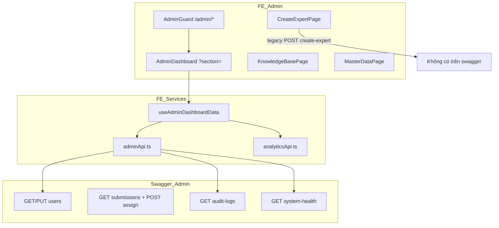

# Audit — Vai trò Admin (Quản trị hệ thống)

> **Nguồn contract API:** `src/api/swagger.json` (OpenAPI **3.0.1**, `VietTuneArchive` v1).  
> **Nguồn FE:** `src/pages/admin/*`, `src/components/admin/*`, `src/features/admin/*`, `src/services/adminApi.ts`, `useAdminDashboardData.ts`.  
> **Runtime BE tham chiếu:** `backend/VietTuneArchive/Controllers/AdminController.cs` (`[Authorize(Roles = "Admin")]`).  
> **Ngày:** 2026-06-01

---

## 1. Tóm tắt điều hành

| Hạng mục | Kết luận |
|----------|----------|
| **Phạm vi Admin FE** | Dashboard 4 section (`users`, `analytics`, `aiMonitoring`, `moderation`), trang `create-expert`, `knowledge-base`, `master-data`, `operations` (feature flag). |
| **Tag `Admin` trên swagger** | **8 operation** trên **7 path** — user, submission, audit, health. |
| **Gap contract nghiêm trọng** | `POST /api/Admin/create-expert` — **FE gọi**, **không có** trong swagger và **không có** action trên `AdminController`. |
| **Gap tích hợp** | Gán reviewer: swagger có `POST .../submissions/{id}/assign`; luồng Expert claim dùng `PUT /api/Submission/assign-reviewer-submission`. |
| **Bảo mật** | Swagger: Bearer global. `AdminController`: **có** `[Authorize(Roles = "Admin")]`. Nhiều API phụ (Analytics, User/GetAll, legacy) cần verify riêng. |



---

## 2. Bảo mật (swagger vs FE)

### 2.1 OpenAPI

```json
"securitySchemes": { "Bearer": { "type": "http", "scheme": "bearer" } },
"security": [ { "Bearer": [] } ]
```

Mọi path kế thừa **JWT Bearer**; swagger **không** mô tả scope theo role ở từng operation.

### 2.2 Frontend

| Cơ chế | File | Hành vi |
|--------|------|---------|
| Route guard | `AdminGuard.tsx` | `ADMIN_ROUTE_POLICY` — chỉ `UserRole.ADMIN`, `requireActive: true` |
| Policy | `routeAccess.ts` | Redirect `/403`, login, hoặc `/` nếu inactive |
| Routes | `App.tsx` | `/admin`, `/admin/create-expert`, `/admin/knowledge-base`, `/admin/master-data`, `/admin/operations` |

Admin **có thể** truy cập thêm (post-login): `/moderation`, `/approved-recordings`, `/researcher` theo `isRedirectAllowedForRole` — ngoài guard `/admin`.

### 2.3 Backend `AdminController`

Toàn controller: `[Authorize(Roles = "Admin")]` — **khớp** kỳ vọng cho tag `Admin`.

**Lưu ý:** Các API dashboard gọi thêm (`/api/Analytics/*`, `/api/User/GetAll`, `/api/Instrument`, …) **không** nằm trong tag `Admin`; quyền phụ thuộc controller tương ứng.

---

## 3. Cấu trúc Frontend Admin

### 3.1 Routes

| Path | Component | Mô tả |
|------|-----------|--------|
| `/admin` | `AdminDashboard.tsx` | Rail: `?section=users\|analytics\|aiMonitoring\|moderation` |
| `/admin/create-expert` | `CreateExpertPage.tsx` | Tạo tài khoản Expert |
| `/admin/knowledge-base` | `KnowledgeBasePanel` / `KnowledgeBasePage` | Quản trị KB |
| `/admin/master-data` | `MasterDataPage.tsx` | CRUD master data |
| `/admin/operations` | `AdminOperationsPage.tsx` | Ops (config flag) |

### 3.2 Dashboard sections (`adminNavConfig.ts`)

| `section` | Panel | Chức năng chính |
|-----------|--------|------------------|
| `users` | `AdminUserManagement` | Vai trò, trạng thái, xóa user (local), hướng dẫn |
| `analytics` | `AdminDashboardAnalyticsPanel` | Thống kê bản thu, dân tộc, nhạc cụ, trend |
| `aiMonitoring` | `AdminDashboardAiMonitoringPanel` | Metric expert, cờ AI, KB, backfill embedding — xem [`AUDIT-giam-sat-phan-hoi-ai.md`](AUDIT-giam-sat-phan-hoi-ai.md) |
| `moderation` | `AdminDashboardModerationPanel` | Yêu cầu xóa/sửa bản thu, xóa expert, bảng bản thu |

**Legacy panels** (trong moderation): `AdminAuditLogPanel`, `AdminSystemHealthCard`, `AdminRecordingTable` — mở qua `legacyPanel`.

### 3.3 Poll / refresh

`useAdminDashboardData` — `usePollWhileVisible(load, 30_000)` — refresh best-effort mỗi 30s khi tab visible.

---

## 4. API contract — tag `Admin` (swagger)

### 4.1 Bảng endpoint

| Method | Path | Query / path | Body | Response 200 |
|--------|------|--------------|------|----------------|
| **GET** | `/api/Admin/users` | `page` (def. **1**), `pageSize` (def. **50**), `role?`, `status?` | — | `PagedList<UserAdminDto>` |
| **GET** | `/api/Admin/users/{id}` | `id` uuid | — | `UserDetailAdminDto` |
| **PUT** | `/api/Admin/users/{id}/role` | `id` | `UpdateRoleRequest` | `BaseResponse` |
| **PUT** | `/api/Admin/users/{id}/status` | `id` | `UpdateStatusRequest` | `BaseResponse` |
| **GET** | `/api/Admin/submissions` | `page`, `pageSize`, `status?`, `reviewer?` | — | `PagedList<SubmissionAdminDto>` |
| **POST** | `/api/Admin/submissions/{id}/assign` | `id` | `AdminRequest.AssignReviewerRequest` | `BaseResponse` |
| **GET** | `/api/Admin/audit-logs` | `page` (def. **1**), `pageSize` (def. **100**), `from?`, `to?` datetime | — | `PagedList<AuditLogDto>` |
| **GET** | `/api/Admin/system-health` | — | — | `SystemHealthDto` |

**Không có trên swagger:**

| FE / nhu cầu | Trạng thái |
|--------------|------------|
| `POST /api/Admin/create-expert` | **Thiếu** — `adminApi.createExpert` → `legacyPost('/Admin/create-expert')` |
| `DELETE` user | **Thiếu** — FE ẩn user qua `localStorage` `admin_deleted_user_ids` |
| Export / bulk actions | **Thiếu** |

### 4.2 Schema — User & submission

**`UserAdminDto`:** `id?`, `email?`, `fullName?`, `role?`, `status?`, `createdAt`.

**`UserDetailAdminDto`:** thêm `songsContributed`, `reviewsCompleted`, `lastLogin?`.

**`UpdateRoleRequest`:** `{ role?: string }`.

**`UpdateStatusRequest`:** `{ status?: string }` — BE map `Active`/`Inactive` → `IsActive` (FE còn gửi thêm `isActive` trong body, không có trong swagger).

**`SubmissionAdminDto`:** `id?`, `title?`, `status?`, `reviewerId?`, `submittedBy?`.

**`AdminRequest.AssignReviewerRequest`:** `{ reviewerId?: string }` (nullable string; BE parse Guid).

**`PagedList<T>`:** `items[]`, `page`, `pageSize`, `total`.

### 4.3 Schema — Audit & health

**`AuditLogDto`:** `id`, `userId?`, `entityType?`, `entityId?`, `action?`, `oldValuesJson?`, `newValuesJson?`, `createdAt`.

**`SystemHealthDto`:** `status?`, `uptime?`, `dbConnections`, `queueLength`, `services?` (map string→string).

---

## 5. API Admin FE dùng ngoài tag `Admin`

`useAdminDashboardData.load()` gọi song song (best-effort):

| Service / gọi | Swagger path | Dùng cho |
|---------------|--------------|----------|
| `adminApi.getUsers()` | **Ưu tiên** `GET /api/User/GetAll` (response `200` **không** khai báo schema) → fallback `GET /api/Admin/users` | Bảng user |
| `analyticsApi.getContributors()` | `GET /api/Analytics/contributors` | Leaderboard đóng góp |
| `analyticsApi.getSubmissionsTrend()` | `GET /api/Analytics/submissions` | Biểu đồ theo tháng |
| `knowledgeBaseApi.countKnowledgeBaseItems()` | `GET /api/kb-entries` (đếm) | Stat AI panel |
| `analyticsApi.getExperts({ period: '30d' })` | `GET /api/Analytics/experts?period=30d` | Bảng hiệu suất chuyên gia |
| `fetchAllMessages(1, 500)` | `GET /api/QAMessage` | Đếm `aiFlaggedCount` |
| `analyticsApi.getOverview()` | `GET /api/Analytics/overview` | Overview strip |
| `legacyGet('/Instrument')` | `GET /api/Instrument` (tag Instrument) | Danh sách nhạc cụ analytics |
| `legacyGet('/Recording')` | Recording endpoints | `remoteTotalRecordings` |
| `legacyGet('/EthnicGroup')` | fallback `/ReferenceData/ethnic-groups` | Phủ sóng dân tộc |
| `legacyGet('/Admin/submissions', { page:1, pageSize:200 })` | **Cùng** `GET /api/Admin/submissions` | `recordings` moderation table |

**Expert queue (không phải dashboard, nhưng Admin có thể dùng):** `expertModerationApi.getAdminSubmissions` → `apiFetch GET /api/Admin/submissions` (typed OpenAPI).

**Claim / assign reviewer (Expert):**

| Swagger | FE thực tế |
|---------|------------|
| `POST /api/Admin/submissions/{id}/assign` | **Không dùng** trong `expertModerationApi` |
| `PUT /api/Submission/assign-reviewer-submission` | `assignReviewerSubmission()` — luồng nhận bài |

---

## 6. Ánh xạ `adminApi.ts` ↔ swagger

| Hàm FE | Swagger / transport | Ghi chú |
|--------|---------------------|---------|
| `getUsers()` | `GET /api/User/GetAll` → `GET /api/Admin/users` | Không truyền `page`/`role`/`status` vào Admin fallback |
| `getUserById()` | `GET /api/Admin/users/{id}` | Typed `apiFetch` |
| `updateUserRole()` | `PUT .../role` body `{ role }` | `AdminDashboard` |
| `updateUserStatus()` | `PUT .../status` body `{ status, isActive }` | `isActive` extra vs swagger |
| `createExpert()` | **`POST /Admin/create-expert`** legacy | **P0 gap** |
| `getAuditLogs()` | `legacyGet('/Admin/audit-logs')` | Có thể chuyển `apiFetch GET /api/Admin/audit-logs` |
| `getSystemHealth()` | `legacyGet('/Admin/system-health')` | Có thể chuyển `apiFetch GET /api/Admin/system-health` |

### 6.1 Component ↔ API

| Component | API chính |
|-----------|-----------|
| `AdminUserManagement` | `updateUserRole`, `updateUserStatus`; list từ `useAdminDashboardData` |
| `AdminAuditLogPanel` | `adminApi.getAuditLogs` |
| `AdminSystemHealthCard` | `adminApi.getSystemHealth` |
| `CreateExpertPage` | `adminApi.createExpert` |
| `AdminDashboard` | orchestration + `recordingRequestService`, `accountDeletionService` (local/demo flows) |

### 6.2 Trạng thái local (không swagger)

| Key | Mục đích |
|-----|----------|
| `users_overrides` (DEV) | Demo đổi role |
| `admin_deleted_user_ids` | Ẩn user khỏi UI — **không** xóa server |
| `accountDeletionService` | Queue xóa expert (client-side) |

---

## 7. Tag `AuditLog` (swagger) vs `Admin/audit-logs`

Swagger có **hai** nhóm audit:

| Nhóm | Ví dụ path | FE Admin dùng |
|------|------------|---------------|
| **Admin** | `GET /api/Admin/audit-logs` | **Có** — `AdminAuditLogPanel` |
| **AuditLog** | `GET /api/AuditLog`, `POST`, `GET/{id}`, `by-submission/{id}` | **Không** trên dashboard Admin |

Trùng domain — cần thống nhất một entry point cho UI admin.

---

## 8. Ma trận rủi ro

| ID | Mức | Vấn đề | Swagger / FE |
|----|-----|--------|--------------|
| **ADM-01** | **P0** | `create-expert` thiếu | FE `legacyPost`; swagger **0** path; `AdminController` **0** action |
| **ADM-02** | **P1** | `getUsers` ưu tiên `User/GetAll` | Swagger `GetAll` không schema; có thể rộng hơn `Admin/users` + filter |
| **ADM-03** | **P1** | Assign reviewer dual path | Swagger `POST Admin/.../assign` vs FE `PUT Submission/assign-reviewer-submission` |
| **ADM-04** | **P1** | `aiFlaggedCount` cap 500 | `GET /api/QAMessage` — xem audit AI |
| **ADM-05** | **P2** | `legacyGet` cho audit/health | Trùng swagger typed; mất type safety |
| **ADM-06** | **P2** | Xóa user chỉ local | Không API DELETE user |
| **ADM-07** | **P2** | `UpdateStatusRequest` vs body FE | Chỉ `status` trên contract; `isActive` thừa |
| **ADM-08** | **P2** | `GET /Recording` + `/Instrument` legacy | Không qua Admin tag; phụ thuộc auth từng controller |
| **ADM-09** | **P3** | `system-health` tĩnh BE | `Uptime = "N/A"`, `DbConnections = 0` hardcode |
| **ADM-10** | **P3** | Dashboard 30s poll | Nhiều request/navigation — chưa có ETag |

---

## 9. Khuyến nghị

### Ngắn hạn

1. **ADM-01:** Thêm `POST /api/Admin/create-expert` vào BE + swagger → `npm run api:sync` → `adminApi` dùng `apiFetch`.  
2. **ADM-03:** Document chính thức: admin assign dùng `POST .../assign` hay expert claim dùng `PUT Submission/...`; deprecate một path.  
3. **ADM-05:** `getAuditLogs` / `getSystemHealth` chuyển `apiFetch` theo swagger.  
4. **ADM-02:** `getUsers` gọi `GET /api/Admin/users` với `pageSize` hợp lý; bỏ hoặc hạn chế `User/GetAll` cho admin.  
5. Truyền query `role`/`status` từ UI filter xuống API (đã có trên swagger).

### Trung hạn

6. API xóa/vô hiệu hóa user thống nhất (không chỉ `localStorage`).  
7. Metric dashboard tách rõ: submission analytics vs expert performance vs chatbot flags.  
8. E2E admin: list users → đổi role → audit log → create expert (sau ADM-01).

---

## 10. Acceptance criteria

- [ ] `POST /api/Admin/create-expert` có trong swagger và FE typed.  
- [ ] `AdminController` actions khớp 8 operation swagger (+ create-expert).  
- [ ] `adminApi` không dùng `legacyGet` cho path đã có trên OpenAPI.  
- [ ] Một luồng assign reviewer được document và test E2E.  
- [ ] `GET /api/Admin/users` hỗ trợ filter `role`/`status` từ UI.  
- [ ] Audit log panel chỉ dùng một API admin (`/api/Admin/audit-logs` hoặc merge với `/api/AuditLog`).

---

## 11. Tài liệu liên quan

| File | Nội dung |
|------|----------|
| `src/api/swagger.json` | Contract (bản audit này) |
| `src/api/generated.d.ts` | Types sinh từ OpenAPI |
| `docs/API-admin-role-swagger.md` | Ghi chú swagger theo role (cần sync) |
| `docs/AUDIT-giam-sat-phan-hoi-ai.md` | Tab AI / QAMessage / RagChat |
| `docs/AUDIT-full-system.md` | Auth tổng thể |
| `docs/UI-UX-admin.md` | UX admin |

---

## Phụ lục A — Checklist đồng bộ swagger ↔ FE

| Operation swagger | `apiFetch` typed | `legacyGet`/`legacyPost` | UI |
|-------------------|------------------|-------------------------|-----|
| GET Admin/users | Fallback only | — | Users table |
| GET User/GetAll | Thử trước | — | Users table |
| PUT role/status | Có | — | User mgmt |
| GET submissions | expertModerationApi | useAdminDashboardData legacy | Moderation |
| POST assign | — | — | **Chưa wire FE** |
| GET audit-logs | — | Có | Audit panel |
| GET system-health | — | Có | Health card |
| POST create-expert | — | Có | Create expert |

---

*Audit dựa trên `src/api/swagger.json` và mã FE tại 2026-06-01. Sau khi BE đổi contract: `npm run api:sync` và cập nhật §4–6.*
