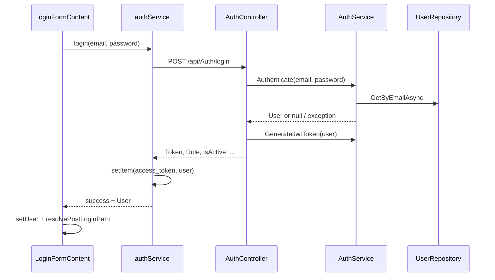

# Audit chi tiết Đăng ký & Đăng nhập (VietTune)

Tài liệu mô tả luồng **đăng ký (register)**, **đăng nhập (login)**, **xác nhận email**, và **quên mật khẩu** trên frontend (React) và backend (ASP.NET Core), kèm trích đoạn mã nguồn và khuyến nghị.

**Nguồn OpenAPI:** `src/api/swagger.json` (đồng bộ qua `npm run api:sync`). Phần **§2.0** đối chiếu trực tiếp với swagger; phần BE/FE mô tả hành vi thực tế khi swagger thiếu schema response.

---

## 1. Tổng quan kiến trúc

| Lớp | Thành phần chính | Vai trò |
|-----|------------------|---------|
| **BE** | `AuthController`, `AuthService` | API công khai: login, register, confirm, forgot/reset password |
| **FE service** | `src/services/authService.ts` | Gọi OpenAPI / legacy HTTP, lưu token + user vào storage |
| **FE state** | `src/stores/authStore.ts`, `src/contexts/AuthContext.tsx` | Zustand + hydrate khi app khởi động |
| **FE UI** | `LoginPage`, `RegisterPage`, `LoginFormContent`, `ConfirmAccountPage`, `ForgotPasswordPage`, `LoginModal` | Form, redirect, OTP overlay |
| **FE guards** | `AuthenticatedGuard`, `routeAccess.ts` | Chặn route theo role / `isActive` (client-only) |



---

## 2. API backend (`AuthController`)

Controller **không** có `[Authorize]` — đúng cho endpoint auth công khai.

| Method | Path | Mô tả |
|--------|------|--------|
| `POST` | `/api/Auth/login` | Email + password → JWT |
| `POST` | `/api/Auth/register-contributor` | Đăng ký role Contributor |
| `POST` | `/api/Auth/register-researcher` | Đăng ký role Researcher |
| `PUT` | `/api/Auth/resend-confirmation-email` | Gửi lại OTP xác nhận (form `email`) |
| `PUT` | `/api/Auth/confirm-email?token=` | Xác nhận email bằng OTP |
| `PUT` | `/api/Auth/forgot-password` | Gửi OTP reset (form `Email`) |
| `PUT` | `/api/Auth/reset-password` | Đổi mật khẩu bằng OTP |

Nguồn: `src/api/swagger.json` (tag `Auth`).

### 2.0 Hợp đồng OpenAPI (đối chiếu `swagger.json`)

Swagger chỉ khai báo **7 path** dưới tag `Auth`. Không có path `/auth/*` legacy. Các endpoint Auth **không** gắn `security` (Bearer) — đúng cho API công khai.

| Method | Path | Request (theo swagger) | Response trong swagger |
|--------|------|------------------------|-------------------------|
| `POST` | `/api/Auth/login` | `application/json` → `LoginModel`: `email`, `password` (nullable) | `200` — **không** có `content` / schema |
| `POST` | `/api/Auth/register-contributor` | `application/json` → `RegisterModel`: `email`, `password`, `fullName`, `phoneNumber` | `200` — không schema |
| `POST` | `/api/Auth/register-researcher` | Giống contributor | `200` — không schema |
| `PUT` | `/api/Auth/resend-confirmation-email` | `multipart/form-data` → field **`email`** (chữ thường) | `200` — không schema |
| `PUT` | `/api/Auth/confirm-email` | Query **`token`** (string) | `200` — không schema |
| `PUT` | `/api/Auth/forgot-password` | `multipart/form-data` → **`Email`** (PascalCase) | `200` — không schema |
| `PUT` | `/api/Auth/reset-password` | `multipart/form-data` → **`Email`**, **`OTP`**, **`NewPassword`** | `200` — không schema |

**Response thực tế (BE, không có trong swagger):**

| Endpoint | Body / status điển hình |
|----------|-------------------------|
| Login | `200`: `{ token, userId, role, fullName, phoneNumber, isActive }` (camelCase JSON); `401` sai credential; `400` exception (vd. chưa xác nhận email) |
| Register | `200` / `400`: bọc `Result<AuthDTO>` (`isSuccess`, `data`, …) |
| Confirm | `200` string hoặc `400` "Token không hợp lệ." |
| Forgot | `200` message cố định; `400` nếu email trống |
| Reset | `200` / `400` theo OTP |

**FE types (`src/api/adapters.ts`):** `ApiAuthLoginModel`, `ApiAuthRegisterModel`, `ApiAuthForgotPasswordModel`, `ApiAuthResetPasswordModel`, `ApiAuthConfirmEmailQuery`. **Không** có adapter riêng cho resend (field form `email`).

**API liên quan profile (tag `User`, không phải `Auth`):**

| Method | Path | Body |
|--------|------|------|
| `PUT` | `/api/User/update-profile` | `UpdateInfoDTO`: `userId`, `avatarUrl`, `fullName`, `phone` |
| `PUT` | `/api/User/update-password` | `UpdatePasswordDTO`: `userId`, `oldPassword`, `newPassword`, `confirmPassword` |

Không có `GET /api/User/me` trong swagger — chỉ `GET /api/User/GetById?id=`.

**Refresh token:** tag `RefreshToken` (`/api/RefreshToken`, …) — **không** nằm trong luồng login; swagger không mô tả cấp refresh token khi đăng nhập.

### 2.1 Login

```22:46:backend/VietTuneArchive/Controllers/AuthController.cs
        [HttpPost("login")]
        public async Task<IActionResult> Login([FromBody] LoginModel model)
        {
            try
            {
                var user = await _authService.Authenticate(model.Email, model.Password);

                if (user == null)
                    return Unauthorized(new { message = "Email hoặc mật khẩu không chính xác." });

                var token = _authService.GenerateJwtToken(user);
                return Ok(new
                {
                    Token = token,
                    UserId = user.Id,
                    Role = user.Role,
                    FullName = user.FullName,
                    PhoneNumber = user.Phone,
                    isActive = user.IsActive
                });
            }
            catch (Exception ex)
            {
                return BadRequest(new { message = ex.Message });
            }
        }
```

**`AuthService.Authenticate`:**

```38:48:backend/VietTuneArchive.Application/Services/AuthService.cs
        public async Task<User> Authenticate(string email, string password)
        {
            var user = await _userRepository.GetByEmailAsync(email);

            if (user == null || !VerifyPassword(password, user.PasswordHash))
                return null;

            if (!user.IsEmailConfirmed)
                throw new Exception("Vui lòng xác nhận email trước khi đăng nhập.");

            return user;
        }
```

| Hành vi | Ghi chú |
|---------|---------|
| Mật khẩu | So khớp **BCrypt** với `PasswordHash` — đúng |
| Email chưa xác nhận | `throw Exception` → HTTP **400** (không phải 401) |
| `IsActive` | **Không** kiểm tra khi login — user inactive vẫn nhận JWT nếu email đã confirm |
| User enumeration | Cùng message 401 khi sai email hoặc sai password — tốt |

### 2.2 Register (Contributor / Researcher)

```49:94:backend/VietTuneArchive/Controllers/AuthController.cs
        [HttpPost("register-contributor")]
        public async Task<IActionResult> RegisterForContributor([FromBody] RegisterModel model)
        {
            var user = new User
            {
                Email = model.Email,
                Password = model.Password,
                ...
                Role = "Contributor",
                IsActive = false,
                ...
            };
            var result = await _authService.Register(user, model.Password);
```

Controller gán **`Password = model.Password` (plaintext)** trước khi gọi `Register`. Service chỉ hash vào `PasswordHash`, nhưng entity vẫn có thể lưu cột `Password` plaintext nếu mapping không xóa.

**`AuthService.Register`:**

- Kiểm tra email trùng → `Failure`
- `ConfirmEmailToken` = OTP 6 chữ số (`Random.Next`)
- `IsEmailConfirmed = false`, `IsActive = false`
- Gửi email qua `EmailService.SendConfirmationEmail`
- Transaction commit

**Lỗi logic nghiêm trọng (validation):**

```102:108:backend/VietTuneArchive.Application/Services/AuthService.cs
        public async Task<Result<AuthDTO>> Register(User user, string password)
        {
            if (user == null)
            {
                var msg = new AuthDTO { Message = "Người dùng không được để trống." };
                return Result<AuthDTO>.Success(msg);
            }
```

Trả về **`Success`** khi `user == null` — client có thể hiểu nhầm là đăng ký thành công.

Tương tự với `password` rỗng (cũng `Success` với message lỗi).

### 2.3 Confirm email

```109:125:backend/VietTuneArchive/Controllers/AuthController.cs
        [HttpPut("confirm-email")]
        public async Task<IActionResult> ConfirmEmail(string token)
        {
            var user = await _userRepository.GetByConfirmationTokenAsync(token);
            ...
            user.IsEmailConfirmed = true;
            user.ConfirmEmailToken = null;
            user.IsActive = true;
            await _userRepository.UpdateAsync(user);
            return Ok("Email đã được xác nhận thành công.");
        }
```

| Rủi ro | Chi tiết |
|--------|----------|
| Brute-force OTP | Không rate limit; OTP 6 số (~1M khả năng) |
| Endpoint công khai | Ai cũng gọi được nếu biết/guess token |
| Không hết hạn token confirm | `ConfirmEmailToken` không có `Expiry` trong flow register |

**Lệch test / swagger / code (xác nhận trong repo):**

| Test / tài liệu | Swagger + controller | Ghi chú |
|-----------------|----------------------|---------|
| `GetAsync("/api/Auth/confirm-email?token=...")` | `PUT` + query `token` | `AuthControllerTests.cs` — test **sai method** |
| `PostAsync("/api/Auth/forgot-password", JSON { email })` | `PUT` + `multipart/form-data` **`Email`** | Test **sai method + content-type** |
| `backend/.../Tests/Prompt/API Test/auth.md` | Ghi `GET` confirm, `POST` forgot | Tài liệu test lỗi thời |

FE production path (`confirmEmail`, `forgotPassword`) khớp swagger; integration tests và prompt test **không** phản ánh contract hiện tại.

### 2.4 Forgot / reset password

- `ForgotPasswordAsync`: user không tồn tại hoặc `!IsActive` → **return im lặng** (không lộ email) — tốt cho privacy
- **Lưu ý `IsActive`:** User mới đăng ký có `IsActive = false` cho đến khi `confirm-email` set `true`. **Quên mật khẩu không gửi OTP** cho tài khoản chưa kích hoạt — người dùng phải xác nhận email trước (hoặc dùng resend confirm).
- OTP 6 số, hết hạn 15 phút (`ResetPasswordTokenExpiry`)
- `ResetPasswordAsync`: yêu cầu `user.IsActive`; cập nhật hash; đồng thời `user.Password = newPassword` (**plaintext**)
- Reset thành công còn set `IsEmailConfirmed = true`
- Controller `forgot-password` / `reset-password`: `[FromForm]` — khớp swagger `multipart/form-data` (field **`Email`**, **`OTP`**, **`NewPassword`**)

---

## 3. JWT & cấu hình bảo mật

```73:99:backend/VietTuneArchive.Application/Services/AuthService.cs
        public string GenerateJwtToken(User user)
        {
            ...
                Expires = DateTime.UtcNow.AddMinutes(120),
```

```24:35:backend/VietTuneArchive/Program.cs
        options.TokenValidationParameters = new()
        {
            ValidateIssuerSigningKey = true,
            IssuerSigningKey = new SymmetricSecurityKey(key),
            ValidateIssuer = false,
            ValidateAudience = false
        };
```

| Mục | Trạng thái |
|-----|------------|
| Thời hạn token | 120 phút |
| Issuer / Audience | Tắt validate |
| Refresh token trong auth flow | **Không** — `RefreshTokenController` tồn tại riêng, không gắn login |
| Claims | `NameIdentifier`, `id`, `Name`, `Role` |

---

## 4. Frontend — `authService.ts`

### 4.1 Login

```12:68:src/services/authService.ts
  login: async (credentials: LoginForm) => {
    ...
      const response = await apiOk<LoginResponse | { data: LoginResponse }>(
        asApiEnvelope<LoginResponse | { data: LoginResponse }>(
          apiFetchLoose.POST('/api/Auth/login', { body: payload }),
        ),
      );
      ...
        const user: User = {
          id: userId,
          username: credentials.email,
          email: credentials.email,
          ...
          isActive: authData.isActive,
          isEmailConfirmed: true,
```

| Vấn đề | Mức |
|--------|-----|
| `isEmailConfirmed: true` **hard-code** sau login | Trung bình — lệch DB nếu BE thay đổi rule |
| Map `Token` → `token` qua JSON camelCase | OK với ASP.NET default |
| Lỗi 400 (chưa confirm email) vs 401 | BE trả `400` + message xác nhận email; nhưng `authService.login` **ghi đè** mọi `400`/`401` thành `'Sai tài khoản hoặc mật khẩu'` → OTP modal trên login **không** nhận đúng message (xem A15) |

### 4.2 Register

- Contributor: `POST /api/Auth/register-contributor`
- Researcher: `POST /api/Auth/register-researcher`
- Payload: `email`, `password`, `fullName`, `phoneNumber` — **không** gửi `username` dù form có thể có field username

### 4.3 Confirm email

```147:159:src/services/authService.ts
  confirmEmail: async (token: string) => {
    ...
      return await apiOk<unknown>(
        asApiEnvelope<unknown>(
          apiFetchLoose.PUT('/api/Auth/confirm-email', { params: { query: params } }),
        ),
      );
```

Khớp Swagger (`PUT` + query `token`).

### 4.4 Forgot password

- `authService.forgotPassword`: `PUT /api/Auth/forgot-password`, `FormData` với **`Email`** — khớp swagger PascalCase.
- `ForgotPasswordPage` chỉ gửi email; toast generic — phù hợp BE (luôn `200` khi email hợp lệ format).

### 4.5 Reset password (thiếu trên FE)

- Swagger + BE: `PUT /api/Auth/reset-password` (`Email`, `OTP`, `NewPassword`).
- **`authService` không có `resetPassword`**; không có route/page nhập OTP + mật khẩu mới sau forgot.
- Luồng reset chỉ hoàn chỉnh qua API/test hoặc công cụ ngoài — gap sản phẩm (A14).

### 4.6 Endpoint legacy / chết

| Method FE | Path | Trạng thái |
|-----------|------|------------|
| `getCurrentUser` | `GET /auth/me` | **Không** có trong `AuthController` / swagger |
| `updateProfile` | `PUT /auth/profile` | Legacy |
| `verifyOtp` | `POST /auth/verify-otp` | Legacy |
| `changePassword` | `POST /auth/change-password` | Legacy — đổi MK đúng contract: `PUT /api/User/update-password` (`UpdatePasswordDTO`) |
| `updateProfile` / pending sync | `PUT /auth/profile` | Legacy — swagger: `PUT /api/User/update-profile` (`ProfilePage` vẫn gọi legacy) |

`fetchCurrentUser` trong `authStore` gọi `/auth/me` → thường fail; store **giữ user local** (hành vi cố ý).

### 4.7 Demo login (DEV)

```285:289:src/services/authService.ts
  loginDemo: async (demoKey: string) => {
    if (!import.meta.env.DEV) {
      throw new Error('loginDemo is not available in production.');
    }
```

Token `demo-token-*` — `isJwtExpired` **không** coi là hết hạn → session demo vô thời hạn trong DEV.

---

## 5. Frontend — UI & luồng người dùng

### 5.1 Routes (`App.tsx`)

| Path | Page |
|------|------|
| `/login` | `LoginPage` |
| `/register`, `/auth/register-researcher` | `RegisterPage` |
| `/confirm-account` | `ConfirmAccountPage` |
| `/forgot-password` | `ForgotPasswordPage` |

### 5.2 Login (`LoginFormContent`)

- Validate email **hoặc** SĐT 10–11 số
- BE chỉ `GetByEmailAsync` → **đăng nhập bằng SĐT không hoạt động** dù UI cho phép
- OTP overlay khi BE trả message xác nhận email
- Sau confirm OTP → tự `runLogin` lại

### 5.3 Register (`RegisterPage`)

- Chọn Contributor / Researcher
- Thành công → toast + `navigate('/confirm-account', { state: { email } })`
- Validation mật khẩu: `validatePassword` (FE)

### 5.4 Confirm account (`ConfirmAccountPage`)

- Nhập OTP 6 số → `authService.confirmEmail`
- **Resend:** UI chỉ đếm ngược 5 phút rồi link "Đăng ký lại" — **không** gọi `PUT /api/Auth/resend-confirmation-email`
- Không truyền `email` vào resend API dù `pendingEmail` có trong `location.state`

### 5.5 Post-login redirect

```121:131:src/utils/routeAccess.ts
export function getDefaultPostLoginPath(user: User): string {
  switch (user.role) {
    case UserRole.ADMIN:
      return '/admin';
    case UserRole.RESEARCHER:
      return '/researcher';
    case UserRole.EXPERT:
      return '/moderation';
    default:
      return '/';
  }
}
```

`resolvePostLoginPath` chặn redirect theo role (ví dụ Contributor không vào `/moderation`).

Researcher chờ duyệt: `isResearcherPendingApproval` (`role === RESEARCHER && !isActive`) — guard client; BE sau confirm email thường set `IsActive = true` nên có thể **không** còn pending trên BE.

---

## 6. State & storage

| Key | Nội dung |
|-----|----------|
| `access_token` | JWT (hoặc `demo-token-*`) |
| `user` | JSON `User` |
| `fromLogout` | session — tránh auto-redirect khỏi `/login` |
| `users_overrides` | Chỉ merge khi `import.meta.env.DEV` (sau chỉnh sửa gần đây) |
| `pending_profile_updates` | Queue cập nhật profile khi API lỗi |

`AuthProvider` khi mount: `clearExpiredCredentialsIfNeeded()` + restore user từ storage.

`apiFetch` middleware gắn `Authorization: Bearer` từ `access_token`.

---

## 7. Guards (chỉ client)

`AuthenticatedGuard` dùng `AUTHENTICATED_ROUTE_POLICY` + `requireActive: true`:

- User `isActive === false` → redirect inactive (message "Tài khoản chưa khả dụng")
- **Không** thay thế kiểm tra `IsActive` trên BE cho mọi API

Expert/Admin routes có guard riêng (`AdminGuard`, `ExpertGuard`, …).

---

## 8. Bảng lỗi / rủi ro tóm tắt

| Ưu tiên | ID | Mô tả | Vị trí |
|---------|-----|--------|--------|
| **Cao** | A1 | Register validation trả `Success` khi user/password null | `AuthService.Register` |
| **Cao** | A2 | Plaintext `Password` lưu DB (register + reset) | `AuthController`, `AuthService.ResetPasswordAsync` |
| **Cao** | A3 | Confirm email không rate limit / OTP yếu | `confirm-email`, `GenerateEmailToken` |
| **Cao** | A4 | Login không kiểm tra `IsActive` | `AuthService.Authenticate` |
| **Trung bình** | A5 | FE login hard-code `isEmailConfirmed: true` | `authService.login` |
| **Trung bình** | A6 | UI cho login SĐT nhưng BE chỉ email | `LoginFormContent` vs `Authenticate` |
| **Trung bình** | A7 | Resend confirmation **chưa** wire API | `ConfirmAccountPage` |
| **Trung bình** | A8 | `GET /auth/me` và profile legacy không tồn tại trên BE auth | `authService` |
| **Trung bình** | A9 | JWT: `ValidateIssuer/Audience = false` | `Program.cs` |
| **Trung bình** | A10 | Chưa confirm email → HTTP 400 thay vì 401 | `AuthController.Login` |
| **Cao** | A14 | Không có UI/`authService.resetPassword` cho `PUT /api/Auth/reset-password` | Toàn bộ FE auth |
| **Cao** | A15 | `login` ghi đè message BE → OTP modal khi chưa confirm email không hoạt động | `authService.login` |
| **Trung bình** | A16 | Forgot/reset yêu cầu `IsActive` — user chưa confirm không nhận OTP reset | `ForgotPasswordAsync` |
| **Trung bình** | A11 | Integration tests + `auth.md`: GET confirm, POST JSON forgot | `AuthControllerTests.cs`, prompt test |
| **Thấp** | A12 | `verifyOtp` → `POST /auth/verify-otp` không có trong swagger | `authService` |
| **Thấp** | A13 | Demo token không expire | `jwtExpiry.ts` + `loginDemo` |
| **Thấp** | A17 | Swagger Auth: mọi response chỉ `200` không schema — khó codegen/contract test | `swagger.json` |

---

## 9. Điểm tích cực

| Mục | Chi tiết |
|-----|----------|
| Hash mật khẩu | BCrypt cho register/login |
| Forgot password | Không tiết lộ email tồn tại hay không |
| Test integration | Register, login, confirm, forgot, reset có coverage cơ bản |
| FE token expiry | `isJwtExpired` + clear credentials on boot |
| DEV demo guard | `loginDemo` chặn production |
| Email confirm gate | Không login được khi chưa confirm (BE) |
| OpenAPI login/register/confirm/forgot | FE dùng `apiFetchLoose` + adapters; forgot dùng `FormData` đúng field `Email` |

---

## 10. Khuyến nghị

| Ưu tiên | Hành động |
|---------|-----------|
| P0 | Sửa `Register` trả `Failure` khi validation fail; không lưu `Password` plaintext |
| P0 | Thêm rate limit + lockout cho `confirm-email` / `reset-password`; OTP crypto RNG; optional expiry cho confirm token |
| P1 | `Authenticate`: từ chối `!IsActive` (trừ role/policy rõ ràng) |
| P1 | Wire `resend-confirmation-email` (`PUT`, form `email`) trên `ConfirmAccountPage` |
| P1 | Trang + `authService.resetPassword` (`PUT`, form `Email`/`OTP`/`NewPassword`) |
| P1 | FE: bỏ login SĐT hoặc BE hỗ trợ `GetByEmailOrPhone`; không ghi đè message login 400 |
| P2 | Profile: `PUT /api/User/update-profile`, `GET /api/User/GetById`; xóa `/auth/me`, `/auth/profile` |
| P2 | Bổ sung response schema Auth vào OpenAPI (login/register/Result) |
| P2 | Refresh token hoặc sliding session; bật validate Issuer/Audience ở production |
| P2 | Sửa integration tests: `PUT` confirm, `PUT` forgot + `multipart/form-data` |

---

## 11. Tài liệu & test liên quan

| Tài liệu / file | Nội dung |
|-----------------|----------|
| `src/api/swagger.json` | 7 path Auth; User update-profile/password; RefreshToken tách biệt |
| `src/api/adapters.ts` | `ApiAuth*` types (không có resend) |
| `src/api/generated.d.ts` | Sinh từ swagger (`npm run api:types`) |
| `backend/VietTuneArchive.Tests/Integration/Controllers/AuthControllerTests.cs` | Register, login, confirm, forgot, reset |
| `src/stores/authStore.test.ts` | Store login/logout |
| `src/utils/routeAccess.test.ts` | Post-login redirect, guard policies |
| `docs/FE-CONTEXT.md` | Mục auth routes & services |

---

*Tài liệu hỗ trợ review bảo mật và onboarding; không thay thế pentest hoặc đánh giá rủi ro theo tổ chức.*
