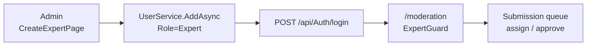

# Audit chi tiết vai trò Chuyên gia (Expert) — VietTune

Tài liệu mô tả luồng **Expert** (Chuyên gia kiểm duyệt) trên frontend (React) và backend (ASP.NET Core), đối chiếu **OpenAPI** (`src/api/swagger.json`) và mã nguồn BE/FE.

**Nguồn hợp đồng API**

| Nguồn | Phạm vi | Ghi chú |
|-------|---------|---------|
| `src/api/swagger.json` | Toàn bộ API (đồng bộ `npm run api:sync`) | **Nguồn chính** cho path, method, schema request |
| `docs/API_DOCUMENTATION.md` | Chỉ **Recording search** (`search-by-filter`, `search-by-filter-multi`) | **Không** mô tả Submission/Expert; dùng khi expert/researcher tra cứu bản thu đã duyệt |
| `backend/.../Controllers/*.cs` | `[Authorize(Roles = ...)]` | Swagger **không** ghi **roles**; có `security: Bearer` toàn cục — §2.0 |

**Liên quan:** `docs/AUDIT-admin-role.md`, `docs/AUDIT-auth-register-login.md`, `docs/PLAN-fe-auth-flow.md`.

---

## 1. Tổng quan vai trò

| Khía cạnh | Chi tiết |
|-----------|----------|
| **Giá trị FE** | `UserRole.EXPERT = 'Expert'` |
| **JWT / BE** | Claim `Role` = `"Expert"`; policy `"Expert"` trong `Program.cs` |
| **Đăng ký công khai** | **Không** — tag `Auth` chỉ `register-contributor` / `register-researcher` |
| **Tạo tài khoản** | Admin → `CreateExpertPage` → `adminApi.createExpert()` (§8 — gap OpenAPI) |
| **Khu vực chính** | `/moderation`, `/approved-recordings` |
| **Post-login mặc định** | `/moderation` |

---

## 2. Hợp đồng OpenAPI (đối chiếu `swagger.json`)

### 2.0 Snapshot `src/api/swagger.json` (đọc lại)

| Mục | Giá trị |
|-----|---------|
| OpenAPI | **3.0.1**, `info.title` = `VietTuneArchive`, `version` = `v1` |
| Số path | **184** (`Object.keys(paths).length`) |
| `securitySchemes` | `Bearer` (http, scheme `bearer`, mô tả "JWT Bearer") |
| `security` (root) | `[{ "Bearer": [] }]` — **mọi operation** khai báo cần JWT trong tài liệu OpenAPI |
| Tag liên quan expert | `Submission` (17), `Review` (4), `AuditLog` (3 path / 6 operation), `Admin` (8), `Media` (6), `SubmissionVersion` (5), `Transcription` (4), `KBEntries`, `Embargo`, `KnowledgeGraph`, `GraphExplorer`, `Analytics`, `Annotation`, `Recording`, … |
| **Không có path** | `POST /api/Admin/create-expert` (grep `create-expert` = 0) |

**Quan trọng:** Swagger ghi Bearer toàn cục nhưng **không** thay thế `[Authorize(Roles)]` trên BE. Một số controller BE là `[AllowAnonymous]` hoặc **không** `[Authorize]` (`AuditLog`, `Annotation`, `Analytics`) — client có thể gửi request **không** token và BE vẫn xử lý (lệch swagger). Cột **BE Roles** dưới đây lấy từ `*Controller.cs`, không từ OpenAPI.

**Path mới (so với audit cũ):** `GET /api/graph-explorer/search`, `GET /api/graph-explorer/expand` (tag `GraphExplorer`); `POST /api/admin/neo4j/migrate-data` (tag `Neo4jAdmin`); `GET /api/search/semantic` (tag `SemanticSearch`); tag `ReferenceData` (ethnic-groups, provinces, ceremonies, …); tag `Transcription` (theo `submissionId`).

### 2.1 `SubmissionStatus` (schema + domain)

| Giá trị `int` | Enum (C#) | FE queue / approved |
|---------------|-----------|---------------------|
| `0` | `Draft` | Không dùng làm hàng đợi moderation |
| `1` | `Pending` | Hàng đợi chờ duyệt (FE ưu tiên `status=1`, fallback `0` rồi lọc) |
| `2` | `Approved` | `ApprovedRecordingsPage` (`get-by-status?status=2`) |
| `3` | `Rejected` | — |
| `4` | `UpdateRequested` | — |
| `5` | `Embargoed` | — |

Nguồn: `VietTuneArchive.Domain.Entities.Enum.SubmissionStatus` trong swagger components.

### 2.2 Tag `Submission` — 17 path trong swagger

| Method | Path | Query / body (swagger) | Response swagger | BE Roles (thực tế) | FE expert |
|--------|------|------------------------|------------------|------------------|-----------|
| `GET` | `/api/Submission/get-by-status` | `status` (enum), `page`, `pageSize` | `200` — **không** schema | `[Authorize]` only (mọi role đã login) | **Có** — queue pending / approved |
| `GET` | `/api/Submission/get-by-reviewer` | `reviewerId` (uuid) | `200` — không schema | Admin, Expert | **Có** — bài đã gán |
| `GET` | `/api/Submission/get-related-submissions` | `submissionId` | `200` — không schema | Admin, Expert | **Có** |
| `GET` | `/api/Submission/my` | `userId`, `page`, `pageSize` | `200` — không schema | `[Authorize]` only | Không (contributor flow) |
| `GET` | `/api/Submission/{id}` | path `id` | `200` / delete có schema | `[Authorize]` only | Gián tiếp |
| `GET` | `/api/Submission/get-all` | `page`, `pageSize` | `200` — không schema | `[Authorize]` only | Không |
| `POST` | `/api/Submission/create-submission` | body `SubmissionDto` | `200` — không schema | Admin, Contributor, Expert | Không (moderation UI) |
| `PUT` | `/api/Submission/assign-reviewer-submission` | `submissionId`, `reviewerId` | `200` — không schema | Admin, Expert | **Có** — claim |
| `PUT` | `/api/Submission/unassign-reviewer-submission` | `submissionId` | `200` — không schema | Admin, Expert | **Có** |
| `PUT` | `/api/Submission/approve-submission` | `submissionId` | `200` — không schema | Admin, Expert | **Có** |
| `PUT` | `/api/Submission/reject-submission` | `submissionId` | `200` — không schema | **Admin, Expert, Contributor** | **Không** (FE dùng `Review/create`) |
| `PUT` | `/api/Submission/done-stage-one` | `submissionId` | `200` — không schema | Admin, Expert | **Có** |
| `PUT` | `/api/Submission/done-stage-two` | `submissionId` | `200` — không schema | Admin, Expert | **Có** |
| `PUT` | `/api/Submission/confirm-submit-submission` | `submissionId` | `200` — không schema | Admin, Expert, Contributor | Không |
| `PUT` | `/api/Submission/edit-request-submission` | `submissionId` | `200` — không schema | Admin, Expert, Contributor | Không |
| `PUT` | `/api/Submission/confirm-edit-submission` | `submissionId` | `200` — không schema | Admin, Expert, Contributor | Không |
| `DELETE` | `/api/Submission/{id}` | path `id` | `ServiceResponse<bool>` | `[Authorize]` only | Không |

**Lưu ý swagger:** Hầu hết action Submission trả `200` **không** có `content`/schema — FE parse `Result<>` / envelope lỏng (`extractSubmissionRows`).

**Tag `SubmissionVersion` (swagger, 5 path):**

| Path |
|------|
| `/api/SubmissionVersion` |
| `/api/SubmissionVersion/{id}` |
| `/api/SubmissionVersion/submission/{submissionId}` |
| `/api/SubmissionVersion/submission/{submissionId}/latest` |
| `/api/SubmissionVersion/submission/{submissionId}/all` |

List endpoint có schema `PagedResponse<SubmissionVersionDto>`; chưa gọi từ `expertModerationApi.ts`.

### 2.3 Tag `Review` — 4 path

| Method | Path | Body (swagger) | BE | FE expert |
|--------|------|----------------|-----|-----------|
| `GET` | `/api/Review/get-by-id/{id}` | — | `[Authorize]` | Không |
| `GET` | `/api/Review/get-by-submissionid/{submissionId}` | — | `[Authorize]` | Không |
| `POST` | `/api/Review/create` | `CreateReviewDto`: `submissionId`, `reviewerId`, `decision` (int32), `comments` | `[Authorize]` — **không** role trên action | **Có** — từ chối / yêu cầu chỉnh sửa |
| `PUT` | `/api/Review/update` | `UpdateReviewDto` | `[Authorize]` | Không |

FE map `decision`: `0` = reject, `1` = request update (`expertModerationApi.ts`).

### 2.4 Tag `AuditLog` — 3 path, 6 operation

| Method | Path | Request (swagger) | Response schema |
|--------|------|-------------------|-----------------|
| `GET` | `/api/AuditLog` | `page`, `pageSize` | `PagedResponse<AuditLogDto>` |
| `POST` | `/api/AuditLog` | body `AuditLogDto` | `ServiceResponse<AuditLogDto>` |
| `GET` | `/api/AuditLog/{id}` | path `id` | `ServiceResponse<AuditLogDto>` |
| `PUT` | `/api/AuditLog/{id}` | body `AuditLogDto` | `ServiceResponse<AuditLogDto>` |
| `DELETE` | `/api/AuditLog/{id}` | — | `ServiceResponse<bool>` |
| `GET` | `/api/AuditLog/by-submission/{id}` | path `id` | `ServiceResponse<List<AuditLogDto>>` |

**`AuditLogDto` (components):** `id`, `userId`, `entityType`, `entityId`, `action`, `oldValuesJson`, `newValuesJson`, `createdAt` — FE expert POST dùng các field này (`expertModerationApi.postExpertModerationAuditLog`).

**BE:** `AuditLogController` **không** có `[Authorize]` → lệch swagger Bearer toàn cục (§9 **E4**).

**Admin audit riêng:** `GET /api/Admin/audit-logs` — `PagedList<AuditLogDto>`, query `page`, `pageSize`, `from`, `to` (swagger) — tag `Admin`, BE có role admin.

### 2.5 Tag `Admin` — liên quan expert (8 path trong swagger)

| Method | Path | FE |
|--------|------|-----|
| `GET` | `/api/Admin/users` | Không (admin) |
| `GET` | `/api/Admin/users/{id}` | Không |
| `PUT` | `/api/Admin/users/{id}/role` | Không |
| `PUT` | `/api/Admin/users/{id}/status` | Không |
| `GET` | `/api/Admin/submissions` | Query: `page`, `pageSize`, `status` (**string**), `reviewer` — response `PagedList<SubmissionAdminDto>`. **Có** nếu `VITE_EXPERT_QUEUE_SOURCE=admin` |
| `POST` | `/api/Admin/submissions/{id}/assign` | Body `AssignReviewerRequest` — admin assign (swagger **POST**, không phải PUT) |
| `GET` | `/api/Admin/audit-logs` | Không |
| `GET` | `/api/Admin/system-health` | Không |

**Không có trong swagger:** `POST /api/Admin/create-expert` — FE vẫn gọi legacy (§8).

### 2.6 Module phụ (swagger + BE roles)

| Tag | Path (tóm tắt) | BE roles / auth | Expert FE |
|-----|----------------|-----------------|-----------|
| `Media` | `/api/Media/submissions/{submissionId}/files`, `/{mediaFileId}`, stream/download/thumbnail, `set-primary` | Theo `MediaController` | Có thể dùng khi xem file bài nộp (chưa qua `expertModerationApi`) |
| `Transcription` | `/api/Transcription/submissions/{submissionId}`, `/auto`, `/verify`, `/versions` | Theo controller | Chưa wire moderation chính |
| `SubmissionVersion` | 5 path dưới `/api/SubmissionVersion/...` | Theo controller | Chưa dùng FE moderation |
| `KBEntries` | `/api/kb-entries`, `/{id}`, status, citations, revisions | Mutations: Expert, Admin | Researcher portal tab KG |
| `Embargo` | `/api/Embargo`, `/recording/{id}`, `/lift` | Expert, Admin | Module recording |
| `KnowledgeGraph` | `/api/KnowledgeGraph/explore`, `search`, `overview`, `stats`, `relationship` | Theo controller | Portal researcher |
| `GraphExplorer` | `GET /api/graph-explorer/search?keyword&label`, `GET .../expand?sourceId&targetLabel&relType` | Theo controller | **Mới** — chưa thấy import FE |
| `Analytics` | 6 path gồm `GET /api/Analytics/experts?period=30d` | `[AllowAnonymous]` | Không moderation UI |
| `Annotation` | 5 path CRUD + `get-by-expert-id` | `[AllowAnonymous]` | Không moderation chính |
| `Recording` | `search-by-filter`, `search-by-filter-multi`, CRUD + `RecordingGuest` mirror | Theo controller | §2.7 |
| `RagChat` | 7 path `/api/rag-chat/...` | Theo controller | Expert có thể **403** một số route (test BE) |
| `Auth` | 7 path | Public (không Bearer thực tế) | `AUDIT-auth-register-login.md` |
| `User` | `GetById`, `update-profile`, `update-password`, … | `[Authorize]` | Profile sau login |

### 2.7 `docs/API_DOCUMENTATION.md` vs swagger `Recording`

Tài liệu markdown **chỉ** mô tả:

| Method | Path | Khớp swagger |
|--------|------|--------------|
| `GET` | `/api/recording/search-by-filter` | Có — `GET /api/Recording/search-by-filter` (casing ASP.NET thường không phân biệt) |
| `POST` | `/api/recording/search-by-filter-multi` | Có — `POST /api/Recording/search-by-filter-multi` |

Body `RecordingFilterMultiDto`: `ethnicGroupIds`, `instrumentIds`, `ceremonyIds`, `regionCodes`, `communeIds`, `page`, `pageSize`, `sortOrder`. Logic OR trong field, AND giữa fields — như mô tả trong `API_DOCUMENTATION.md`.

**Expert approved list hiện tại** không gọi hai endpoint trên; dùng `GET /api/Submission/get-by-status?status=2` qua `useApprovedRecordings` / `expertModerationApi`.

---

## 3. Định tuyến và guard (FE)

### 3.1 Routes

| Path | Component | Guard |
|------|-----------|--------|
| `/moderation` | `ModerationPage` | `ExpertGuard` |
| `/approved-recordings` | `ApprovedRecordingsPage` | `ExpertGuard` |
| `/dashboard` | redirect → `/moderation` | — |

### 3.2 `ExpertGuard` + `EXPERT_ROUTE_POLICY`

- Chỉ `UserRole.EXPERT`, `requireActive: true`.
- Unauthorized → `/403`; inactive → `/`; chưa login → `/login?redirect=...`.
- **Không** kiểm tra `isEmailConfirmed` (khác `ModerationPage`).

`isRedirectAllowedForRole`: Admin **được** redirect tới `/moderation` sau login, nhưng `ExpertGuard` **chặn** Admin khi vào route → Admin không dùng UI moderation qua guard.

### 3.3 Kiểm tra bổ sung trong page

`ModerationPage`: `user.role === EXPERT` **và** `isEmailConfirmed` **và** `isActive`.

`ApprovedRecordingsPage`: chỉ `user.role === EXPERT` — không check email confirm / active (E12).

---

## 4. Luồng kiểm duyệt (FE)

### 4.1 Feature flags

| Biến | Mặc định | Ý nghĩa |
|------|----------|---------|
| `VITE_EXPERT_API_PHASE2` | bật | Queue + mutation từ API |
| `VITE_EXPERT_QUEUE_SOURCE` | `by-status` | `by-status` → `GET .../get-by-status`; `admin` → `GET .../Admin/submissions` |

### 4.2 Queue (`expertWorkflowService.getQueue`)

Phase 2: `get-by-status` (pending) + `get-by-reviewer` + dedupe + overlay `EXPERT_MODERATION_STATE`.

Phase 1 (`VITE_EXPERT_API_PHASE2=false`): chỉ local meta + overlay.

### 4.3 Claim → wizard → quyết định

| Bước | API (Phase 2) |
|------|----------------|
| Claim | `PUT .../assign-reviewer-submission` |
| Stage 1 / 2 | `PUT .../done-stage-one`, `done-stage-two` |
| Approve | `PUT .../approve-submission` |
| Reject / yêu cầu sửa | `POST .../Review/create` (**không** `reject-submission`) |
| Audit (best-effort) | `POST .../AuditLog` |

### 4.4 Khóa ché expert

`isLockedToAnotherExpert`: so `claimedBy` / `reviewerId` với user hiện tại (`expertSubmissionLock.ts`).

---

## 5. Ma trận FE ↔ OpenAPI

| Chức năng | Swagger path | Gọi từ FE | Ghi chú |
|-----------|--------------|-----------|---------|
| Queue pending | `GET /Submission/get-by-status` | `expertModerationApi` | `status=1` (+ fallback 0) |
| Queue admin alt | `GET /Admin/submissions` | Khi `QUEUE_SOURCE=admin` | Admin-only trên BE |
| My assignments | `GET /Submission/get-by-reviewer` | Có | |
| Claim / unclaim | `PUT assign` / `unassign` | Có | |
| Approve | `PUT approve-submission` | Có | |
| Reject UI | `POST /Review/create` | Có | Swagger có; BE chỉ `[Authorize]` |
| Reject BE alt | `PUT reject-submission` | **Không** | Contributor được gọi — rủi ro API (E3) |
| Stages | `PUT done-stage-one/two` | Có | 400/409 coi success (idempotent) |
| Audit trail | `POST /AuditLog` | Có | Controller mở |
| Tạo expert | `POST /Admin/create-expert` | `adminApi` legacy | **Không** trong swagger |

---

## 6. Auth & tài khoản Expert

| Luồng | API / ghi chú |
|-------|----------------|
| Login | `POST /api/Auth/login` — 7 path Auth trong swagger |
| Register | Không role Expert |
| Demo (DEV) | `loginDemo('expert_a' \| …)` |
| Profile | `PUT /api/User/update-profile`, `update-password` — không `/me` |

Chi tiết: `docs/AUDIT-auth-register-login.md` §2.0.

---

## 7. Lưu trữ local

| Key | Mục đích |
|-----|----------|
| `EXPERT_MODERATION_STATE` | Overlay sau API |
| `EXPERT_REVIEW_NOTES_BY_SUBMISSION` | Draft ghi chú |
| `users_overrides` | DEV sau `CreateExpertPage` |

Phase 2 vẫn merge overlay — có thể lệch server đa thiết bị (E5).

---

## 8. Tạo Expert (Admin) — ngoài OpenAPI

### 8.1 FE

`adminApi.createExpert()` → `legacyPost('/Admin/create-expert', { email, password, fullName })`.

### 8.2 BE

- `UserService.AddAsync(CreateExpertUserDTO)` có.
- `AdminController`: **không** action `create-expert`.
- `swagger.json`: **không** path `create-expert`.

| Ưu tiên | Khuyến nghị |
|---------|-------------|
| **P0** | Thêm `POST /api/Admin/create-expert` + `npm run api:sync` |
| P1 | Production không phụ thuộc `users_overrides` |

---

## 9. Bảng rủi ro / lỗi

| Ưu tiên | ID | Mô tả | Swagger / BE / FE |
|---------|-----|--------|-------------------|
| **Cao** | E1 | `POST /Admin/create-expert` FE gọi, **không** trong OpenAPI và `AdminController` | Gap contract |
| **Cao** | E2 | `get-by-status` chỉ `[Authorize]` — Researcher/Contributor đọc queue theo status | Swagger có path; BE thiếu Roles |
| **Cao** | E3 | `reject-submission` cho Contributor — FE expert không dùng nhưng API vẫn mở | Path có trong swagger |
| **Cao** | E4 | `AuditLog` BE không `[Authorize]` — lệch swagger **Bearer** toàn cục | OpenAPI yêu cầu JWT; BE vẫn mở |
| **Trung bình** | E15 | `GET /Admin/submissions` swagger `status` là **string**; FE/BE submission enum là **int** | Admin queue alt |
| **Cao** | E13 | `POST /Review/create` chỉ `[Authorize]` — user tự gửi `reviewerId` bất kỳ | Swagger có `CreateReviewDto` |
| **Trung bình** | E5 | Overlay local lệch BE | FE |
| **Trung bình** | E6 | Pending `0` vs `1` — FE fallback | Enum swagger 0–5 |
| **Trung bình** | E7 | Guard vs page: `isEmailConfirmed` | FE |
| **Trung bình** | E8 | Admin redirect `/moderation` nhưng `ExpertGuard` chặn | FE |
| **Trung bình** | E9 | `get-by-status` 400 → FE `[]` | FE |
| **Trung bình** | E14 | `API_DOCUMENTATION.md` không phản ánh API moderation — dễ nhầm là catalog đầy đủ | Docs |
| **Thấp** | E10 | `done-stage-*` coi 400/409 success | FE |
| **Thấp** | E11 | Expert không register public — đúng product | Auth swagger |
| **Thấp** | E12 | `ApprovedRecordingsPage` không check confirm/active | FE |

---

## 10. Điểm tích cực

| Mục | Chi tiết |
|-----|----------|
| Phase 2 mặc định | Queue + assign/approve theo swagger paths |
| Reject flow | Khớp `POST /Review/create` + schema `CreateReviewDto` |
| Lock expert | `isLockedToAnotherExpert` |
| Tests | `expertSubmissionLock`, `expertQueueProjection`, route access |
| Approved list | `get-by-status` status = `Approved` (2) |

---

## 11. Khuyến nghị

| Ưu tiên | Hành động |
|---------|-----------|
| P0 | `POST /api/Admin/create-expert` + OpenAPI |
| P0 | `[Authorize(Roles = "Admin,Expert")]` trên `get-by-status`, `get-all`, `my`, `{id}` GET |
| P0 | `reject-submission` → Admin, Expert only; validate reviewer trên `Review/create` |
| P1 | `[Authorize]` trên `AuditLogController` |
| P1 | Đồng bộ `ExpertGuard` với `isEmailConfirmed` |
| P1 | Mở rộng `API_DOCUMENTATION.md` hoặc đổi tên → tránh hiểu nhầm là API catalog |
| P2 | Giảm overlay; chuẩn hóa pending = `1` only |
| P2 | `npm run api:sync` sau mỗi thay đổi BE |

---

## 12. Tài liệu & file tham chiếu

| File | Nội dung |
|------|----------|
| `src/api/swagger.json` | Hợp đồng OpenAPI |
| `docs/API_DOCUMENTATION.md` | Recording search only |
| `src/services/expertModerationApi.ts` | HTTP expert |
| `src/services/expertWorkflowService.ts` | Queue, overlay |
| `backend/.../SubmissionController.cs` | Roles thực tế |
| `backend/.../ReviewController.cs` | Review create |
| `backend/.../AuditLogController.cs` | Audit mở |

---

## 13. Checklist acceptance

- [ ] Expert chỉ tạo qua Admin sau khi có `create-expert` trong swagger.
- [ ] Login → `/moderation` (active + email confirmed trên moderation).
- [ ] Claim/unclaim khớp `assign-reviewer` / `unassign-reviewer` swagger.
- [ ] Approve → `approve-submission`; reject UI → `Review/create` (không phụ thuộc `reject-submission`).
- [ ] Contributor không đọc queue / reject submission người khác (sau fix E2/E3).
- [ ] `POST /AuditLog` chỉ khi đã auth (sau fix E4).
- [ ] Production không dùng `users_overrides`.

---

*Tài liệu hỗ trợ review bảo mật và onboarding. Đối chiếu `src/api/swagger.json`: **184 path**, global `Bearer`, không có `create-expert`. Chạy `npm run api:sync` sau khi BE đổi contract. Không thay thế pentest.*
