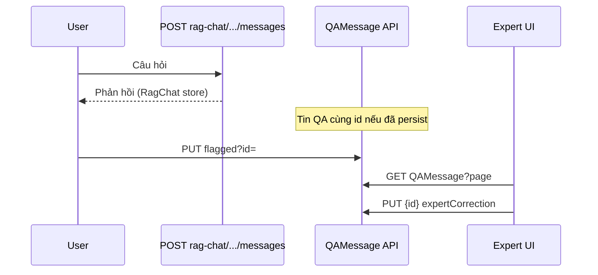

# Audit — Giám sát phản hồi của AI

> **Nguồn contract API:** `src/api/swagger.json` (OpenAPI **3.0.1**, title `VietTuneArchive`, version **v1**).  
> **Phạm vi UI:** Tab chuyên gia **「Giám sát phản hồi của AI」** (`/moderation` → `ai`), **ChatbotPage**, **AdminDashboard** → 「Giám sát hệ thống AI」.  
> **Ngày:** 2026-06-01  
> **Phương pháp:** Đối chiếu swagger ↔ `qaMessageService.ts` / `ragChatService.ts` ↔ component FE; kiểm tra controller BE khi swagger không mô tả hành vi runtime.

---

## 1. Tóm tắt điều hành

| Hạng mục | Kết luận |
|----------|----------|
| **Mục tiêu** | Giám sát câu trả lời chatbot (RAG): **cắm cờ**, **bản sửa chuyên gia**, **bỏ cờ**; admin theo dõi metric + xử lý cờ + backfill embedding KB. |
| **Hoàn thiện** | **~65%** — luồng CRUD/flag theo swagger có trên FE; **không có** API list-only-flagged, filter `role`, hay pipeline retrain trong contract. |
| **Contract vs runtime** | Swagger khai báo **Bearer toàn cục**; controller `QAMessage` / `QAConversation` **không** gắn `[Authorize]` trong mã — cần verify triển khai (xem §7). |

**Lưu ý quan trọng từ swagger:**  
`PUT /api/QAMessage/flagged` là **đặt trạng thái cờ** cho một message (`id` query), **không phải** `GET` danh sách message đã cờ. FE hiện lấy danh sách cờ bằng `GET /api/QAMessage` + lọc client `flaggedByExpert === true`.

---

## 2. Bảo mật (theo swagger)

```json
"securitySchemes": { "Bearer": { "type": "http", "scheme": "bearer", "description": "JWT Bearer" } },
"security": [ { "Bearer": [] } ]
```

| Khía cạnh | Swagger | Ghi chú triển khai |
|-----------|---------|-------------------|
| Mọi path QA / RagChat | Kế thừa **Bearer** | Không có `security: []` override trên từng operation. |
| Role-based (Admin/Expert) | **Không** mô tả trong OpenAPI | Không có `403` schema, không có header role — chỉ JWT. |
| `QAConversation/get-by-user` | `userId` (query, uuid) | IDOR tiềm ẩn nếu runtime không kiểm tra JWT.sub === userId. |

**Khuyến nghị:** Coi swagger là *yêu cầu* auth; audit runtime (`QAMessageController.cs`, `QAConversationController.cs`) bắt buộc khớp trước production.

---

## 3. API contract — tag `QAMessage`

### 3.1 Bảng endpoint (swagger)

| Method | Path | Query / path | Request body | Response 200 (schema) |
|--------|------|--------------|--------------|------------------------|
| **GET** | `/api/QAMessage/get-by-conversation` | `conversationId` (uuid) | — | `ServiceResponse<IEnumerable<QAMessageDto>>` |
| **PUT** | `/api/QAMessage/flagged` | `id` (uuid) | — | `ServiceResponse<boolean>` |
| **PUT** | `/api/QAMessage/unflagged` | `id` (uuid) | — | `ServiceResponse<boolean>` |
| **GET** | `/api/QAMessage` | `page` (default **1**), `pageSize` (default **10**) | — | `PagedResponse<QAMessageDto>` |
| **POST** | `/api/QAMessage` | — | `QAMessageDto` | `ServiceResponse<QAMessageDto>` |
| **GET** | `/api/QAMessage/{id}` | `id` (path, uuid) | — | `ServiceResponse<QAMessageDto>` |
| **PUT** | `/api/QAMessage/{id}` | `id` (path, uuid) | `QAMessageDto` | `ServiceResponse<QAMessageDto>` |
| **DELETE** | `/api/QAMessage/{id}` | `id` (path, uuid) | — | `ServiceResponse<boolean>` |

**Không có trong swagger (nhưng có trong `QAMessageService.cs` BE):**

- `GetFlaggedMessagesAsync()` — logic nội bộ, **chưa** expose HTTP.
- Query `flaggedOnly`, `role`, `conversationId` trên `GET /api/QAMessage` — **không** có.

### 3.2 Schema `QAMessageDto` (swagger)

| Property | Type | Nullable | Dùng cho giám sát |
|----------|------|----------|-------------------|
| `id` | uuid | | Khóa cờ / sửa |
| `conversationId` | uuid | | Liên kết hội thoại |
| `role` | int32 | | FE lọc Assistant = **1** (không enum trong swagger) |
| `content` | string | yes | Nội dung phản hồi AI |
| `sourceRecordingIdsJson` | string | yes | JSON array — FE parse hiển thị link bản thu |
| `sourceKBEntryIdsJson` | string | yes | Nguồn KB (chưa hiển thị đầy đủ trên UI expert) |
| `confidenceScore` | double | yes | Hiển thị trên `FlaggedResponseList` |
| `flaggedByExpert` | boolean | | Trạng thái cờ |
| `correctedByExpertId` | uuid | yes | Gán khi lưu bản sửa |
| `expertCorrection` | string | yes | Bản sửa chuyên gia |
| `createdAt` | date-time | | Sắp xếp danh sách |

### 3.3 `PagedResponse<QAMessageDto>` (swagger)

| Property | Type |
|----------|------|
| `success` | boolean |
| `message` | string? |
| `data` | `QAMessageDto[]`? |
| `total` | int32 |
| `page` | int32 |
| `pageSize` | int32 |
| `errors` | string[]? |

**Hệ quả FE:** `total` đếm **mọi** message (User + Assistant). `ModerationAITab` lọc `role === 1` sau khi GET → phân trang **lệch** so với `total` (AI-SUP-03).

---

## 4. API contract — tag `QAConversation` (ngữ cảnh)

| Method | Path | Params | Response |
|--------|------|--------|----------|
| **GET** | `/api/QAConversation/get-by-user` | `userId` (uuid) | `200` (body không chi tiết schema trong snippet) |
| **GET** | `/api/QAConversation` | `page`, `pageSize` (default 10) | `PagedResponse<QAConversationDto>` |
| **POST** | `/api/QAConversation` | body `QAConversationDto` | `ServiceResponse<QAConversationDto>` |
| **GET/PUT/DELETE** | `/api/QAConversation/{id}` | `id` path | CRUD tương ứng |

**`QAConversationDto`:** `id`, `userId`, `title?`, `createdAt`.

Chatbot dùng conversation QA + merge tin RAG; giám sát cờ gắn vào **QAMessage** khi `id` trùng.

---

## 5. API contract — tag `RagChat` (nguồn phản hồi AI)

| Method | Path | Mô tả |
|--------|------|--------|
| **POST** | `/api/rag-chat/conversations` | Tạo hội thoại (`CreateConversationRequest`) |
| **GET** | `/api/rag-chat/conversations` | Liệt kê hội thoại |
| **GET** | `/api/rag-chat/conversations/{id}` | Chi tiết + messages (response `200` không mô tả schema chi tiết trong swagger) |
| **DELETE** | `/api/rag-chat/conversations/{id}` | Xóa hội thoại |
| **POST** | `/api/rag-chat/conversations/{id}/messages` | Gửi tin (`SendMessageRequest`) → sinh phản hồi AI |
| **POST** | `/api/rag-chat/embeddings/backfill` | Backfill embedding 384-dim |
| **POST** | `/api/rag-chat/embeddings/backfill-768` | Backfill embedding 768-dim (Gemini) |
| **POST** | `/api/rag-chat/embeddings/regenerate/{recordingId}` | Regenerate theo bản thu |
| **POST** | `/api/rag-chat/embeddings/generate/{recordingId}` | Generate embedding bản thu |

**Liên quan giám sát:** Admin panel gọi backfill qua `ragChatService`; **không** có endpoint “retrain chat model” hay “apply expertCorrection to model”.

---

## 6. API contract — Admin metrics (tag `Analytics`)

Dùng bởi **Giám sát hệ thống AI** (không phải tab expert), vẫn trong phạm vi “giám sát AI” tổng thể:

| Method | Path | Query | Response data |
|--------|------|-------|----------------|
| **GET** | `/api/Analytics/experts` | `period` (string, default **`30d`**) | `List<ExpertPerformanceResponseDto>` |
| **GET** | `/api/Analytics/overview` | — | `OverviewMetricsDto` |
| (khác) | `/api/Analytics/submissions`, `coverage`, `content`, `contributors` | — | Dashboard tổng |

**`ExpertPerformanceResponseDto`:** `expertId`, `name?`, `reviews`, `accuracy`, `avgTime?` — **không** phải accuracy chatbot RAG.

---

## 7. Ánh xạ Frontend ↔ Swagger

### 7.1 `qaMessageService.ts`

| Hàm FE | Swagger | Ghi chú |
|--------|---------|---------|
| `fetchAllMessages(page, pageSize)` | `GET /api/QAMessage` | Admin: `page=1, pageSize=500`; tab expert list: `pageSize=20` |
| `fetchConversationMessages` | `GET .../get-by-conversation` | Chatbot merge với RAG |
| `flagMessage` | `PUT .../flagged?id=` | |
| `unflagMessage` | `PUT .../unflagged?id=` | |
| `updateMessage` | `PUT /api/QAMessage/{id}` | Body full `QAMessageDto` — lưu `expertCorrection` |
| `getMessageById` | `GET /api/QAMessage/{id}` | Ít dùng trên UI giám sát |
| `createQAMessage` | `POST /api/QAMessage` | Persist QA song song RAG (nếu có) |

**Default swagger `pageSize=10` vs FE:** `PAGE_SIZE_QA_MESSAGES = 10` (`pagination.ts`); admin override **500**; `FlaggedResponseList` **500** + filter cờ.

### 7.2 UI components

| UI | API swagger sử dụng |
|----|---------------------|
| `ModerationAITab` | `GET /api/QAMessage`, `PUT flagged`; nhúng `FlaggedResponseList` |
| `FlaggedResponseList` | `GET /api/QAMessage` (500) + `PUT unflagged` + `PUT {id}` |
| `ChatbotPage` / `ChatMessageItem` | `PUT flagged` / `unflagged` |
| `AdminDashboardAiMonitoringPanel` | `Analytics/experts`, `GET QAMessage` (count), `POST rag-chat/embeddings/*` |
| `ragChatService` | Toàn bộ `/api/rag-chat/*` |

### 7.3 Luồng dữ liệu (RAG + QA)



**Rủi ro:** Message chỉ tồn tại trên RagChat, `id` không có trong `QAMessage` → **không cờ được** qua contract hiện tại (AI-SUP-04).

---

## 8. Ma trận rủi ro (cập nhật theo swagger)

| ID | Mức | Vấn đề | Swagger / thực tế |
|----|-----|--------|-------------------|
| **AI-SUP-01** | **P0** | Auth JWT | Swagger: Bearer global. Runtime: controller có thể không enforce — **verify BE**. |
| **AI-SUP-02** | **P1** | Không API list flagged | Chỉ `PUT /flagged`; list = `GET` + filter client |
| **AI-SUP-03** | **P1** | Phân trang Assistant sai | `GET` không có `role`; `total` mixed roles |
| **AI-SUP-04** | **P1** | RAG ↔ QA đồng bộ | RagChat paths tách tag; không schema merge trong swagger |
| **AI-SUP-05** | **P2** | `PUT /flagged` tên gây hiểu nhầm | Dễ tưởng GET list — document/OpenAPI `summary` |
| **AI-SUP-06** | **P2** | Cap 500 im lặng | `fetchAllMessages` fail → `{ data: [], total: 0 }` không throw |
| **AI-SUP-07** | **P2** | `role` không enum | Swagger `int32`; FE hardcode `1` = Assistant |
| **AI-SUP-08** | **P2** | Không retrain endpoint | Chỉ embedding backfill trong `RagChat` |
| **AI-SUP-09** | **P3** | `QAConversation/get-by-user` | `userId` query — IDOR nếu không bind JWT |
| **AI-SUP-10** | **P3** | RagChat `200` thiếu schema message | Khó codegen/validate merge FE |

---

## 9. UI/UX (không đổi scope swagger)

| Điểm mạnh | Điểm yếu |
|-----------|----------|
| Tab expert tách queue kiểm duyệt | `FlaggedResponseList` copy thiếu dấu tiếng Việt |
| Virtual scroll danh sách cờ | Expert tab: correction chỉ trên block “đã cờ” |
| Confirm unflag | UUID bản thu thay vì tiêu đề |
| | Chatbot flag lỗi chỉ `console.error` |

---

## 10. Khuyến nghị mở rộng contract (swagger)

Đề xuất bổ sung vào `swagger.json` / BE (ưu tiên):

1. **`GET /api/QAMessage`** — query `flaggedOnly: boolean`, `role: int32`, `conversationId: uuid` (optional).  
2. **`GET /api/QAMessage/flagged`** (hoặc đổi tên `PUT` hiện tại thành `PUT .../flag`) — tránh nhầm `PUT /flagged`.  
3. **Operation `security` + `403`** — document role Admin | Expert cho mutation.  
4. **`QAMessageDto`:** enum `role` { User=0, Assistant=1 }; optional `flaggedAt`, `flaggedByUserId`.  
5. **RagChat:** schema response message đồng bộ với `QAMessageDto.id`.  
6. **Analytics:** metric riêng `chatbotFlaggedCount`, `avgResolutionTime` (tách expert review accuracy).

---

## 11. Acceptance criteria (sau remediation)

- [ ] Mọi operation §3–5 enforce Bearer + role tại runtime (khớp swagger).  
- [ ] `GET /api/QAMessage?flaggedOnly=true` (hoặc tương đương) — `total` khớp danh sách cờ.  
- [ ] `GET` với `role=1` — phân trang `ModerationAITab` khớp server.  
- [ ] Cờ từ Chatbot → xuất hiện trong tab expert (`id` QA tồn tại).  
- [ ] OpenAPI codegen (`generated.d.ts`) regenerate sau khi sửa swagger.  
- [ ] E2E: flag → listed → `PUT {id}` correction → unflag.

---

## 12. Tài liệu & file tham chiếu

| Tài liệu | Vai trò |
|----------|---------|
| **`src/api/swagger.json`** | Contract chính thức (bản audit này) |
| `src/api/generated.d.ts` | Types sinh từ OpenAPI |
| `src/services/qaMessageService.ts` | Client QAMessage |
| `src/services/ragChatService.ts` | Client RagChat |
| `docs/API-admin-role-swagger.md` | Ghi chú admin + QA (cần sync với swagger) |
| `docs/AUDIT-full-system.md` | Auth gap tổng thể |
| `backend/.../QAMessageController.cs` | Runtime vs swagger |

---

## Phụ lục A — Checklist đồng bộ swagger

| Kiểm tra | Trạng thái |
|----------|------------|
| `PUT /api/QAMessage/flagged` documented as mutation not list | ✅ (audit này) |
| `DELETE /api/QAMessage/{id}` có trong swagger | ✅ — FE chưa dùng |
| Global `security: Bearer` | ✅ |
| Per-operation role scopes | ❌ |
| Filter query on `GET /api/QAMessage` | ❌ |
| `GetFlaggedMessagesAsync` on HTTP | ❌ |

---

*Audit dựa trên `src/api/swagger.json` tại thời điểm 2026-06-01. Khi swagger thay đổi, regenerate `generated.d.ts` và cập nhật §3–6.*
