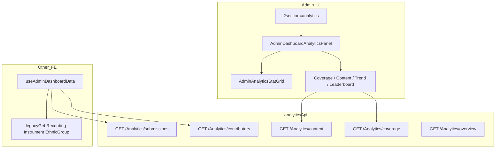

# Audit — Phân tích & thống kê

> **Nguồn contract API:** `src/api/swagger.json` (OpenAPI **3.0.1**, `VietTuneArchive` v1).  
> **Nguồn FE:** `src/services/analyticsApi.ts`, `src/components/features/analytics/*`, `AdminDashboardAnalyticsPanel`, `useAdminDashboardData.ts`.  
> **Runtime BE:** `backend/VietTuneArchive/Controllers/AnalyticsController.cs`.  
> **Ngày:** 2026-06-01

---

## 1. Tóm tắt điều hành

| Hạng mục | Kết luận |
|----------|----------|
| **Vị trí UI** | Admin → `/admin?section=analytics` — rail **「Phân tích & thống kê」** (`adminNavConfig.ts`). |
| **Tag swagger `Analytics`** | **6 endpoint GET** — overview, submissions, coverage, content, experts, contributors. |
| **Hoàn thiện BE** | **2/6 stub** (`overview`, `submissions` trả object rỗng + message *"Not implemented yet"*). **4/6** gọi `IAnalyticsService`. |
| **Bảo mật runtime** | `AnalyticsController` có **`[AllowAnonymous]`** — trái swagger Bearer global và kỳ vọng admin-only. |
| **Hoàn thiện FE** | Biểu đồ Recharts hoạt động khi API có dữ liệu; nhiều số liệu **fallback** từ `legacyGet` (`/Recording`, `/Instrument`, `/EthnicGroup`) và đếm client-side từ submissions. |



---

## 2. Bảo mật (swagger vs runtime)

### 2.1 OpenAPI

- Global `security: [{ Bearer: [] }]`.
- Không có operation-level override → contract kỳ vọng JWT.

### 2.2 `AnalyticsController.cs`

```csharp
[AllowAnonymous]
public class AnalyticsController : ControllerBase
```

| Hệ quả | Mức |
|--------|-----|
| Bất kỳ client (kể cả chưa đăng nhập) có thể gọi `/api/Analytics/*` nếu server không chặn ở middleware khác | **P0** |
| Dữ liệu leaderboard contributor, coverage gap, expert performance lộ công khai | **P1** |

**Khuyến nghị:** `[Authorize(Roles = "Admin")]` (hoặc Admin + Expert cho một số metric) và bỏ `AllowAnonymous`.

### 2.3 Frontend

- Chỉ user qua `AdminGuard` mới **thấy** UI; nhưng API vẫn gọi được từ DevTools/script nếu BE anonymous.

---

## 3. API contract — tag `Analytics` (swagger)

### 3.1 Bảng endpoint

| Method | Path | Query | Response 200 (`ServiceResponse`) |
|--------|------|-------|----------------------------------|
| **GET** | `/api/Analytics/overview` | — | `OverviewMetricsDto` |
| **GET** | `/api/Analytics/submissions` | — | `SubmissionAnalyticsDto` |
| **GET** | `/api/Analytics/coverage` | — | `List<CoverageChartDto>` |
| **GET** | `/api/Analytics/content` | `type` (string, default **`songs`**) | `ContentAnalyticsResponseDto` |
| **GET** | `/api/Analytics/experts` | `period` (string, default **`30d`**) | `List<ExpertPerformanceResponseDto>` |
| **GET** | `/api/Analytics/contributors` | — | `List<ContributorLeaderboardDto>` |

Tất cả response bọc trong `ServiceResponse<T>` (`success`, `data`, `message`, `errors`).

### 3.2 Schema DTO (swagger)

**`OverviewMetricsDto`**

| Field | Type |
|-------|------|
| `totalSongs` | int32 |
| `totalViews` | int32 |
| `activeUsers` | int32 |
| `newSubmissions` | int32 |
| `growthRate` | double |

**`SubmissionAnalyticsDto`**

| Field | Type |
|-------|------|
| `total` | int32 |
| `byStatus` | object (map string→int) |
| `avgReviewTime` | string? |
| `topEthnicGroups` | string[]? |

**`CoverageChartDto`**

| Field | Type |
|-------|------|
| `name`, `label`, `ethnicity`, `region` | string? |
| `count`, `value` | int32 |

**`ContentAnalyticsResponseDto`**

| Field | Type |
|-------|------|
| `totalSongs` | int32 |
| `byEthnicity`, `byRegion` | map string→int |

**`ContributorLeaderboardDto`**

| Field | Type |
|-------|------|
| `userId` | uuid |
| `username`, `fullName` | string? |
| `contributionCount`, `approvedCount`, `rejectedCount` | int32 |

**`ExpertPerformanceResponseDto`**

| Field | Type |
|-------|------|
| `expertId` | uuid |
| `name` | string? |
| `reviews` | int32 |
| `accuracy` | double |
| `avgTime` | string? |

### 3.3 Runtime BE vs swagger

| Endpoint | Swagger | `AnalyticsController` thực tế |
|----------|---------|-------------------------------|
| `overview` | `OverviewMetricsDto` | **Stub** — `Data = new OverviewMetricsDto()`, `Message = "Not implemented yet"` |
| `submissions` | `SubmissionAnalyticsDto` | **Stub** — tương tự |
| `coverage` | `List<CoverageChartDto>` | `GetCoverageAsync()` |
| `content` | `ContentAnalyticsResponseDto` | `GetContentAnalyticsAsync(type)` |
| `experts` | `List<ExpertPerformanceResponseDto>` | `GetExpertPerformanceAsync(period)` — dùng ở tab **Giám sát AI**, không phải tab analytics |
| `contributors` | `List<ContributorLeaderboardDto>` | `GetContributorLeaderboardAsync()` |

---

## 4. Cấu trúc Frontend

### 4.1 Điều hướng

| Thành phần | File |
|------------|------|
| Rail label | `ADMIN_DASHBOARD_NAV_ITEMS` → `analytics` — **「Phân tích & thống kê」** |
| Panel shell | `AdminDashboardPanels` → `step === 'analytics'` |
| Trang chính | `AdminDashboardAnalyticsPanel.tsx` — title **「Phân tích bộ sưu tập」** |
| Tóm tắt desktop | `AdminOverviewStrip` (trên dashboard, mọi section) — bản ghi, user, cờ AI, KB |

### 4.2 Thành phần con trong tab analytics

| Thứ tự UI | Component | Nguồn dữ liệu chính |
|-----------|-----------|---------------------|
| Stat cards | `AdminAnalyticsStatGrid` | Props từ `useAdminDashboardData` |
| Nhạc cụ (tags) | inline trong panel | `legacyGet('/Instrument')` — **không** Analytics API |
| Health | `AdminSystemHealthCard` | `GET /api/Admin/system-health` |
| Audit | `AdminAuditLogPanel` | `GET /api/Admin/audit-logs` |
| Độ phủ dân tộc | `CoverageGapChart` | `GET /api/Analytics/coverage` (tự fetch) |
| Phân tích nội dung | `ContentAnalyticsPanel` | `GET /api/Analytics/content?type=songs` (tự fetch) |
| Xu hướng tháng | `MonthlyTrendChart` | `monthlyCountsFinal` từ hook |
| Bảng xếp hạng | `ContributorLeaderboard` | `GET /api/Analytics/contributors` (tự fetch) |

**Lưu ý:** Health + Audit nằm trong tab analytics nhưng **không** thuộc tag `Analytics` — gây lẫn scope khi audit.

### 4.3 `useAdminDashboardData` — liên quan analytics

Trong `load()` (`Promise.allSettled`):

| Gọi | Swagger / API | Dùng cho analytics |
|-----|---------------|-------------------|
| `analyticsApi.getContributors()` | `GET /Analytics/contributors` | Merge vào bảng user (không feed trực tiếp `ContributorLeaderboard`) |
| `analyticsApi.getSubmissionsTrend()` | `GET /Analytics/submissions` | `remoteMonthlyCounts` → `MonthlyTrendChart` |
| `analyticsApi.getOverview()` | `GET /Analytics/overview` | `remoteTotalRecordings` (field FE `totalRecordings` — **không** khớp swagger) |
| `legacyGet('/Recording')` | Recording API | Đếm tổng bản ghi + fallback trend |
| `legacyGet('/Instrument')` | Instrument | `remoteInstruments`, `remoteInstrumentCount` |
| `legacyGet('/EthnicGroup')` | EthnicGroup / ReferenceData fallback | `ethnicGroupCount` |
| `adminApi.getUsers()` | Admin/User | `allUsersCount` stat |

**`monthlyCountsFinal`:**

```text
remoteMonthlyCounts ?? monthlyCounts(client từ recordings.uploadedDate)
```

Nếu `GET /Analytics/submissions` stub/rỗng → chart tháng dùng **đếm local** từ danh sách submission admin (200 bản).

### 4.4 `analyticsApi.ts` ↔ swagger

| Hàm FE | HTTP | Ghi chú |
|--------|------|---------|
| `getOverview()` | `GET /api/Analytics/overview` | `apiFetchLoose` + `extractObject` |
| `getSubmissionsTrend()` | `GET /api/Analytics/submissions` | Parse `Record<string, number>` — **không** khớp `SubmissionAnalyticsDto` (object có `total`, `byStatus`, …) |
| `getCoverage()` | `GET /api/Analytics/coverage` | `extractArray` |
| `getContributors()` | `GET /api/Analytics/contributors` | `extractArray` |
| `getExperts(period)` | `GET /api/Analytics/experts?period=` | Tab AI monitoring |
| `getContent(type)` | `GET /api/Analytics/content?type=` | default `songs` |

### 4.5 Types FE vs swagger (`src/types/analytics.ts`)

| FE type | Swagger tương ứng | Lệch |
|---------|-------------------|------|
| `AnalyticsOverview.totalRecordings` | `OverviewMetricsDto.totalSongs` | **Tên field khác**; overview stub nên thường null |
| `ContentAnalyticsDto.mostViewedSongs` | Không có trên swagger | FE thừa field |
| `ContributorRow` | `ContributorLeaderboardDto` | FE hỗ trợ alias `id`, `submissions` khi merge user |

---

## 5. Biểu đồ & UX

| Chart | Thư viện | Empty state | Giới hạn hiển thị |
|-------|----------|-------------|-------------------|
| `CoverageGapChart` | Recharts Bar | Toast + alert amber | Top 16 cột; gaps &lt; 2 bản ghi |
| `ContentAnalyticsPanel` | Recharts Bar + Pie | Tương tự | Top 12 dân tộc pie |
| `MonthlyTrendChart` | Recharts Bar | *"Chưa có dữ liệu xu hướng theo tháng"* | Key `YYYY-MM` |
| `ContributorLeaderboard` | Bảng HTML | Loading / error | Sort theo API |

**E2E:** `tests/e2e/40-analytics-charts.spec.ts`, `36-admin-dashboard.spec.ts` — kiểm tra heading và chart containers.

---

## 6. Ma trận rủi ro

| ID | Mức | Vấn đề |
|----|-----|--------|
| **ANA-01** | **P0** | `AnalyticsController` `[AllowAnonymous]` — lộ metric |
| **ANA-02** | **P1** | `overview` + `submissions` **chưa implement** BE — trend/overview FE dựa fallback |
| **ANA-03** | **P1** | `getSubmissionsTrend()` parse sai shape — kỳ vọng `Record<string,number>` trong khi swagger là `SubmissionAnalyticsDto` |
| **ANA-04** | **P1** | `AnalyticsOverview.totalRecordings` vs `OverviewMetricsDto.totalSongs` — không map được khi BE implement |
| **ANA-05** | **P2** | **Double fetch:** hook gọi `getContributors` + `ContributorLeaderboard` gọi lại |
| **ANA-06** | **P2** | Tab analytics chứa Audit + System health — không thuộc analytics |
| **ANA-07** | **P2** | Instrument/EthnicGroup/Recording qua `legacyGet` — không typed OpenAPI |
| **ANA-08** | **P2** | `remoteTotalRecordings` = `recordingArr.length` từ list không phân trang đầy đủ — có thể thiếu bản ghi |
| **ANA-09** | **P3** | `getExperts` dùng ở AI tab nhưng cùng service — dễ nhầm ownership |
| **ANA-10** | **P3** | Không có refresh đồng bộ giữa chart tự fetch và `load()` 30s poll |

---

## 7. Khuyến nghị

### Ngắn hạn

1. **ANA-01:** Bỏ `AllowAnonymous`; `[Authorize(Roles = "Admin")]`.  
2. **ANA-02–03:** Implement `GetSubmissions` trả `byMonth` hoặc `Dictionary<string,int>`; FE map đúng `SubmissionAnalyticsDto`.  
3. **ANA-04:** Thống nhất `OverviewMetricsDto` ↔ `AnalyticsOverview` (codegen + mapper).  
4. Gộp fetch: truyền `contributors` từ hook xuống `ContributorLeaderboard` (bỏ ANA-05).  
5. Tách Audit/Health sang section riêng hoặc accordion «Vận hành hệ thống».

### Trung hạn

6. Implement `overview` (totalSongs/views/activeUsers/growthRate) cho `AdminOverviewStrip`.  
7. Query `type` trên content: document enum (`songs`, `recordings`, …).  
8. Export CSV snapshot từ dashboard analytics.  
9. Unit test `normalizeCoverageRows` / `getSubmissionsTrend` parser.

---

## 8. Acceptance criteria

- [ ] `/api/Analytics/*` yêu cầu JWT + role Admin (hoặc policy documented).  
- [ ] `GET /Analytics/submissions` trả dữ liệu trend theo tháng; `MonthlyTrendChart` không phụ thuộc fallback khi API OK.  
- [ ] `GET /Analytics/overview` trả metric thật; stat «Tổng bản ghi» khớp BE.  
- [ ] FE types khớp swagger sau `npm run api:sync`.  
- [ ] Một request `contributors` / section load (không double fetch).  
- [ ] E2E pass: tab 「Phân tích & thống kê」 + charts có data hoặc empty state rõ.

---

## 9. Liên quan

| Tài liệu | Nội dung |
|----------|----------|
| [`docs/AUDIT-admin-role.md`](AUDIT-admin-role.md) | Admin dashboard, `legacyGet` |
| [`docs/AUDIT-giam-sat-phan-hoi-ai.md`](AUDIT-giam-sat-phan-hoi-ai.md) | `GET /Analytics/experts` trên tab Giám sát AI |
| `src/api/swagger.json` | Contract |
| `src/services/analyticsApi.ts` | Client |
| `tests/e2e/40-analytics-charts.spec.ts` | Smoke UI |

---

## Phụ lục A — Checklist swagger ↔ FE

| Endpoint | Implemented BE | FE component dùng | Có dữ liệu thật khi test |
|----------|----------------|-------------------|---------------------------|
| `GET /coverage` | Có service | `CoverageGapChart` | Phụ thuộc DB |
| `GET /content` | Có | `ContentAnalyticsPanel` | Phụ thuộc DB |
| `GET /contributors` | Có | `ContributorLeaderboard` + merge users | Phụ thuộc DB |
| `GET /submissions` | **Stub** | `MonthlyTrendChart` (fallback recordings) | Thường fallback |
| `GET /overview` | **Stub** | `remoteTotalRecordings` (fallback Recording list) | Thường fallback |
| `GET /experts` | Có | Tab **aiMonitoring** only | Phụ thuộc DB |

---

*Audit dựa trên `src/api/swagger.json` và mã FE tại 2026-06-01. Cập nhật sau khi BE bỏ stub và siết auth.*
