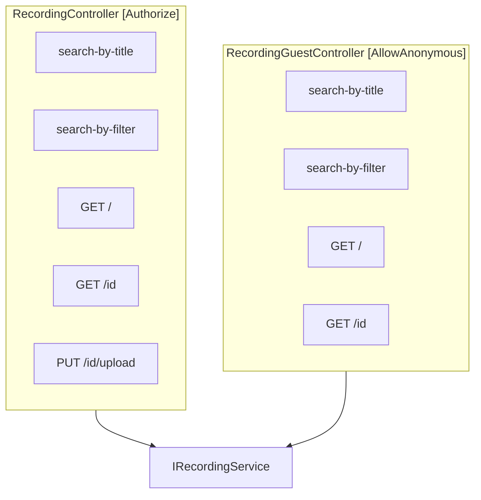

# VietTune — Audit: Recording Compare & Dual Catalog

> **Date:** 2026-05-29  
> **Scope:** So sánh `Recording` vs `RecordingGuest`, luồng tìm kiếm/xem chi tiết, tính năng đối chiếu 2 bản thu (Researcher), contract FE/BE  
> **Tham chiếu:** `docs/AUDIT-main-flows.md` (F5), integration tests `RecordingControllerTests.cs`

---

## 1. Executive Summary

VietTune có **hai catalog API song song** cho cùng entity `Recording`:

| API | Auth | Dữ liệu trả về |
|-----|------|----------------|
| `/api/Recording/*` | JWT + roles | Mọi trạng thái (`Draft`, `Pending`, `Approved`, …) |
| `/api/RecordingGuest/*` | `[AllowAnonymous]` | Chỉ `SubmissionStatus.Approved` |

**Tính năng “Compare Recording”** (đối chiếu 2 bản thu) là **100% client-side** trên Researcher Portal — **không có** `GET /api/Recordings/compare` trên BE (chỉ có trong plan nội bộ).

**Rủi ro chính cho demo:**

| # | Severity | Vấn đề |
|---|----------|--------|
| R1 | P1 | Guest `/recordings/:id` không fallback `RecordingGuest/{id}` — direct URL fail |
| R2 | P2 | Guest search dùng mapper khác auth (`mapGuestRowToRecording` vs raw BE shape) — field lệch |
| R3 | P2 | `SearchByFilterApprovedAsync` filter **in-memory** sau full search — `Total` có thể sai |
| R4 | P3 | Swagger có `search-by-filter-multi` — **không có** controller |
| R5 | P3 | Compare tab dùng dataset từ `/api/Recording/search-by-filter` — không lọc Approved ở BE query |

---

## 2. Kiến trúc: Recording vs RecordingGuest

### 2.1 Controller mirror (cùng route shape)



| Endpoint (relative) | Recording | RecordingGuest | Service method (Guest) |
|---------------------|-----------|----------------|------------------------|
| `search-by-title` | `SearchByTitleAsync` | `SearchByTitleApprovedAsync` | Filter `Status == Approved` sau search |
| `search-by-filter` | `SearchByFilterAsync` | `SearchByFilterApprovedAsync` | Filter approved in-memory |
| `GET /` | `GetAllRecordingsAsync` | `GetPaginatedApprovedAsync` | DB filter `Status == Approved` |
| `GET {id}` | `GetRecordingByIdAsync` | `GetByIdApprovedAsync` | `Id + Status == Approved` |
| `PUT {id}/upload` | Có | **Không** | — |

**Evidence — Guest chỉ approved:**

```536:544:backend/VietTuneArchive.Application/Services/RecordingService.cs
 public async Task<ServiceResponse<GetRecordingDto>> GetByIdApprovedAsync(Guid id)
 {
 var recording = await _recordingRepository.GetFirstOrDefaultAsync(r => r.Id == id && r.Status == SubmissionStatus.Approved);
 if (recording == null)
 {
 return new ServiceResponse<GetRecordingDto> { Success = false, Message = "Recording not found or not available" };
 }
 return new ServiceResponse<GetRecordingDto> { Success = true, Data = _mapper.Map<GetRecordingDto>(recording) };
 }
```

**Evidence — Auth get-by-id không lọc status:**

```502:523:backend/VietTuneArchive.Application/Services/RecordingService.cs
 public async Task<ServiceResponse<GetRecordingDto>> GetRecordingByIdAsync(Guid id)
 {
 // ...
 var entity = await _recordingRepository.GetByIdAsync(id);
 // ... no Status filter
```

### 2.2 Integration test (visibility contract)

```226:239:backend/VietTuneArchive.Tests/Integration/Controllers/RecordingControllerTests.cs
 [Fact]
 public async Task Recording_AdminCanSeeAllStatuses_GuestSeesOnlyApproved()
 {
 var draftId = await SeedRecording(SubmissionStatus.Draft, "Draft Visibility");

 AuthenticateAs("Admin");
 var adminResp = await GetAsync($"/api/Recording/{draftId}");
 adminResp.StatusCode.Should().Be(HttpStatusCode.OK);

 Client.DefaultRequestHeaders.Authorization = null;
 var guestResp = await GetAsync($"/api/RecordingGuest/{draftId}");
 guestResp.StatusCode.Should().Be(HttpStatusCode.NotFound);
 }
```

| Scenario | `GET /api/Recording/{id}` | `GET /api/RecordingGuest/{id}` |
|----------|---------------------------|--------------------------------|
| Approved | 200 (auth) | 200 (anonymous) |
| Draft / Pending | 200 (auth Admin) | **404** |
| No token | **401** | 200 (if Approved) |

---

## 3. Frontend: Ai gọi API nào?

### 3.1 Bảng routing FE → API

| UI | Điều kiện | API | Client |
|----|-----------|-----|--------|
| `/explore` | Guest | `RecordingGuest/*` | `legacyGetAnonymous` |
| `/explore` | Logged in | `Recording/*` hoặc semantic | `apiFetch` |
| `/search` | Luôn auth path | `Recording/*` only | `apiFetch` — **401 nếu chưa login** |
| `/recordings/:id` | Detail | `GET /api/Recording/{id}` first | `apiFetch` — **không gọi Guest** |
| Researcher Portal catalog | Filter search | `GET /api/Recording/search-by-filter` | `apiFetch` |
| Researcher Compare tab | 2 recordings | **Không gọi API compare** — dùng list đã load | In-memory |

### 3.2 Explore (đúng pattern Guest vs Auth)

```176:216:src/features/explore/utils/exploreRecordingsLoad.ts
 } else if (!isAuthenticated) {
 // ... recordingService.getGuestRecordings / getGuestRecordingsByFilter
 } else if (Object.keys(...).length > 0) {
 const res = await recordingService.searchRecordings(activeFilters, ...);
```

### 3.3 Detail page (gap R1)

```80:89:src/hooks/useRecordingDetail.ts
 try {
 const response = await recordingService.getRecordingById(id);
 // ...
 } catch (err) {
 console.warn('GET /Recording/{id} failed, trying submission / list fallbacks', err);
 }
```

**Không có** `recordingService.getGuestRecordingById` — backend có `GET /api/RecordingGuest/{id}` nhưng FE chưa wire.

**Workaround hiện tại:** Navigate từ Explore với `state: { preloadedRecording }` → OK. Direct URL guest → fail hoặc fallback submission/list chậm.

### 3.4 Hai mapper khác nhau (gap R2)

**Guest list** — `mapGuestRowToRecording` gán default mạnh (region, instruments, `verificationStatus: VERIFIED`):

```69:159:src/services/recordingService.ts
function mapGuestRowToRecording(row: unknown, index: number): Recording {
 // ... defaults: Region.RED_RIVER_DELTA, RecordingType.OTHER, VERIFIED, etc.
}
```

**Auth list** — `toPaginatedRecordingsResponse` giữ shape BE gần nguyên bản, ít normalize hơn.

**Hệ quả:** Cùng recording ID có thể **hiển thị khác** giữa `/explore` (guest) và `/search` (auth) nếu BE trả field thiếu.

### 3.5 Researcher catalog vs Guest variant

Researcher dùng **auth** filter:

```173:181:src/services/researcherRecordingFilterSearch.ts
 apiFetch.GET('/api/Recording/search-by-filter', {
 params: { query: openApiQueryRecord(apiQuery) },
 }),
```

Đã có **guest-safe** twin nhưng Researcher Portal **không dùng**:

```201:234:src/services/researcherRecordingFilterSearch.ts
/** Guest-safe variant using `/api/RecordingGuest/search-by-filter` */
export async function fetchGuestRecordingsSearchByFilter(...)
```

---

## 4. Compare Recording (Researcher) — FE-only

### 4.1 Không có BE compare API

Plan nội bộ BE (chưa implement):

```65:71:backend/VietTuneArchive/Prompt/VietTune_BE_API_Implementation_Plan.md
## 4. Compare API
GET /api/Recordings/compare?recordingIds=id1,id2
- compare 2 recordings
```

**Swagger:** không có path `/compare` cho Recording (grep: 0 controller actions).

### 4.2 Luồng UI

```
ResearcherPortalPage
  → useResearcherData() → fetchRecordingsSearchByFilter → approvedRecordings (alias searchResults)
  → ResearcherPortalCompareTab
       → compareLeftId / compareRightId (state)
       → leftRecording = approvedRecordings.find(id)
       → DualAudioComparePlayer + CompareWorkstation (spectrogram)
       → buildExpertComparativeNotes(left, right) — heuristic client
       → instrumentDetectionService — AI per side (optional)
```

**Props:**

```17:23:src/components/researcher/ResearcherPortalCompareTab.tsx
export interface ResearcherPortalCompareTabProps {
 approvedRecordings: Recording[];
 compareLeftId: string;
 compareRightId: string;
 setCompareLeftId: React.Dispatch<React.SetStateAction<string>>;
 setCompareRightId: React.Dispatch<React.SetStateAction<string>>;
}
```

### 4.3 Logic đối chiếu (client heuristic)

```182:211:src/features/researcher/researcherRecordingUtils.ts
export function buildExpertComparativeNotes(left?: Recording, right?: Recording): string[] {
 // ethnicity diff, shared instruments, regionalVariation metadata
}
```

| Feature | Nguồn | Ghi chú |
|---------|-------|---------|
| Transcript diff | `getTranscriptText` + `highlightTranscriptDiff` | Phụ thuộc field có trên `Recording` |
| Same base song | `getBaseSongTitle` + normalize | Extra fields `baseSongTitle` có thể không từ BE |
| Spectrogram | `CompareWorkstation` + `VITE_ENABLE_SPECTROGRAM_COMPARE` | Client audio analysis |
| AI instruments | `instrumentDetectionService` | Gọi BE detection riêng, không phải compare API |

### 4.4 Dataset cho Compare không = “chỉ Approved”

`useResearcherData` load qua `fetchRecordingsSearchByFilter` → **`/api/Recording/search-by-filter`** (all statuses matching filter, không force Approved ở query).

Guest-approved filter chỉ áp dụng trên `RecordingGuest` path. Researcher có thể thấy **Pending/Draft** trong dropdown compare nếu BE trả về và filter metadata khớp.

**Khác** `ApprovedRecordingsPage` (Expert) dùng `fetchApprovedSubmissionsForExpert` → `get-by-status?status=2`.

---

## 5. Swagger / Contract drift

| Path | Swagger | Controller | FE usage |
|------|---------|------------|----------|
| `GET /api/Recording/search-by-filter` | Yes | Yes | Explore (auth), Search, Researcher |
| `POST /api/Recording/search-by-filter-multi` | Yes | **No** | Documented in `API_DOCUMENTATION.md` only |
| `GET /api/RecordingGuest/search-by-filter` | Yes | Yes | Explore (guest) |
| `POST /api/RecordingGuest/search-by-filter-multi` | Yes | **No** | — |
| `GET /api/Recordings/compare` | **No** | **No** | Plan doc only |

---

## 6. Backend service: Approved filter semantics

### 6.1 `SearchByFilterApprovedAsync` — post-filter + Total rewrite

```256:266:backend/VietTuneArchive.Application/Services/RecordingService.cs
 public async Task<Result<RecordingSearchResultDto>> SearchByFilterApprovedAsync(RecordingFilterDto filter)
 {
 var result = await SearchByFilterAsync(filter);
 if (result.IsSuccess)
 {
 var filteredData = result.Data.Data.Where(r => r.Status == SubmissionStatus.Approved).ToList();
 result.Data.Data = filteredData;
 result.Data.Total = filteredData.Count;
 return Result<RecordingSearchResultDto>.Success(result.Data, $"Found {filteredData.Count} approved recordings");
 }
```

| Issue | Impact |
|-------|--------|
| Full DB/search rồi filter RAM | Performance khi DB lớn |
| `Total = filteredData.Count` (page items) | Pagination total **không** phải total DB approved — có thể lệch với `GetPaginatedApprovedAsync` |

### 6.2 `GetPaginatedApprovedAsync` — đúng query DB

```456:466:backend/VietTuneArchive.Application/Services/RecordingService.cs
 public async Task<PagedResponse<GetRecordingDto>> GetPaginatedApprovedAsync(int page, int pageSize)
 {
 var (items, totalItems) = await _recordingRepository.GetPaginatedAsync(r => r.Status == SubmissionStatus.Approved, page, pageSize);
```

**Khuyến nghị:** Guest list nên ưu tiên pattern này cho mọi guest search (đã dùng cho `GET /RecordingGuest`).

---

## 7. Findings (classified)

### P1 — Ảnh hưởng demo / UX rõ

| ID | Finding | Root cause | Fix |
|----|---------|------------|-----|
| **RC-01** | Guest direct URL `/recordings/:id` fail | `useRecordingDetail` không gọi `RecordingGuest/{id}` | Thêm `getGuestRecordingById` + fallback khi 401 |
| **RC-02** | `/search` không có guest mode | `SearchPage` chỉ `recordingService.searchRecordings` | Dùng `fetchGuestRecordingsSearchByFilter` khi `!user` hoặc redirect login |
| **RC-03** | `ChatController` / `MetadataSuggest` open | Không `[Authorize]` | Thêm auth (liên quan upload metadata) |

### P2 — Data consistency

| ID | Finding | Root cause | Fix |
|----|---------|------------|-----|
| **RC-04** | Guest vs auth card shape khác | `mapGuestRowToRecording` vs raw mapping | Shared normalizer `mapApiRowToRecording(row, { guestDefaults })` |
| **RC-05** | Guest filter search Total sai tiềm ẩn | `SearchByFilterApprovedAsync` in-memory total | Repository method `SearchApprovedByFilterAsync` |
| **RC-06** | Compare dropdown có thể chứa non-approved | Researcher dùng `/Recording/search-by-filter` | Filter `status === Approved` client-side hoặc dùng Guest API |

### P3 — Tech debt / plan

| ID | Finding | Fix |
|----|---------|-----|
| **RC-07** | `search-by-filter-multi` swagger stale | Implement BE hoặc xóa khỏi swagger |
| **RC-08** | BE Compare API chưa có | Implement hoặc document FE-only compare |
| **RC-09** | `fetchGuestRecordingsSearchByFilter` unused in Researcher | Wire nếu cần public researcher demo |

---

## 8. Demo checklist — Recording flows

| Demo step | Dùng | Tránh |
|-----------|------|-------|
| Khách xem catalog | `/explore` | `/search` (cần login) |
| Khách xem chi tiết | Click từ Explore (preload) | Paste URL `/recordings/:id` trực tiếp |
| Researcher tìm bản thu | Researcher tab Search (đã login) | — |
| Đối chiếu 2 bản | Researcher tab Compare, chọn 2 ID từ list | Expect server-side compare API |
| Admin xem draft | `GET /api/Recording/{draftId}` | `RecordingGuest/{draftId}` → 404 đúng |

---

## 9. Recommended alignment (không bắt buộc cho demo tối thiểu)

1. **FE:** `useRecordingDetail` → try `Recording/{id}` → on 401 try `RecordingGuest/{id}`.
2. **FE:** Một hàm `mapApiRecordingRow(row, options)` thay cho guest-only mapper.
3. **BE:** `SearchByFilterApprovedAsync` query DB với `Status == Approved` thay vì filter sau.
4. **Researcher Compare:** `fetchRecordingsSearchByFilter` thêm `.filter(r => r.verificationStatus === VERIFIED)` hoặc query param `status=Approved` nếu BE hỗ trợ.
5. **BE (sau demo):** `GET /api/Recording/compare?ids=` trả metadata diff + transcript summary — giảm logic client.

---

## 10. Evidence index

| File | Role |
|------|------|
| `backend/.../RecordingController.cs` | Auth catalog |
| `backend/.../RecordingGuestController.cs` | Public approved catalog |
| `backend/.../Services/RecordingService.cs` | Approved vs all logic |
| `src/services/recordingService.ts` | Guest mapper + dual clients |
| `src/services/researcherRecordingFilterSearch.ts` | Researcher + guest filter twins |
| `src/features/explore/utils/exploreRecordingsLoad.ts` | Guest/auth branch |
| `src/hooks/useRecordingDetail.ts` | Detail without guest fallback |
| `src/components/researcher/ResearcherPortalCompareTab.tsx` | Compare UI |
| `src/features/researcher/researcherRecordingUtils.ts` | Compare heuristics |
| `backend/.../Tests/.../RecordingControllerTests.cs` | Visibility contract tests |

---

*Audit static analysis — không thay thế E2E test dual-player (`tests/e2e/33-dual-player.spec.ts`).*
