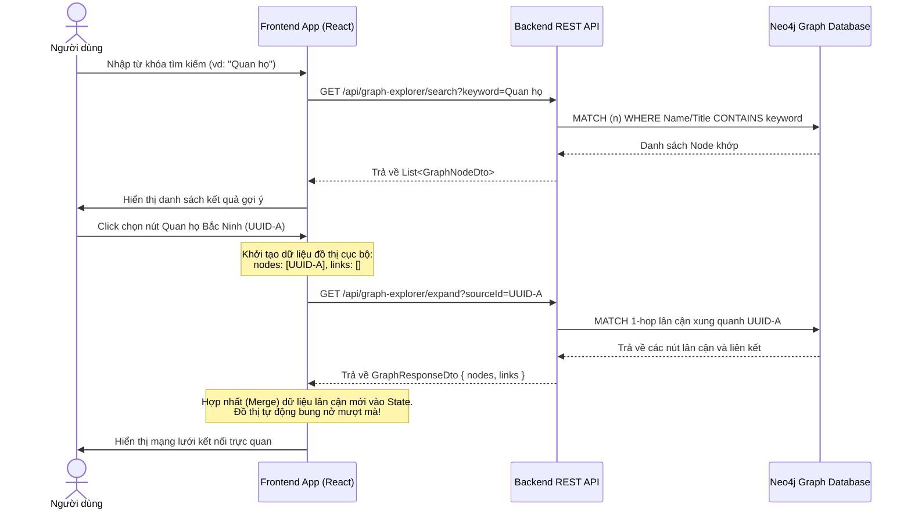

# Hướng dẫn Phát triển Frontend: Trực quan hóa Đồ thị Tri thức Neo4j (Knowledge Graph)

Tài liệu này cung cấp hướng dẫn đầy đủ, production-ready để nhà phát triển Frontend tích hợp các API khám phá đồ thị của `VietTuneArchive` và tạo ra giao diện đồ thị tri thức tương tác đỉnh cao (Force-directed Graph) bằng React.

---

## 1. Kiến trúc luồng hoạt động (Data & Interaction Flow)

Để tối ưu hóa hiệu năng, đồ thị tri thức được tải theo cơ chế **Khám phá Động (Search & Dynamic Expand)**:
1.  **Search:** Người dùng nhập từ khóa tìm kiếm -> FE gọi API `/search` để hiển thị danh sách gợi ý.
2.  **Initialize:** Người dùng chọn một thực thể -> Nút đó trở thành nút trung tâm duy nhất trên khung vẽ đồ thị ban đầu.
3.  **Expand (1-Hop):** Double-click vào bất kỳ nút nào -> FE gọi API `/expand` để lấy các nút lân cận và vẽ bung ra xung quanh nút đó.
4.  **Details Panel:** Click chuột trái vào một nút -> Hiển thị thông tin chi tiết của thực thể ở thanh Sidebar phụ.



---

## 2. Chi tiết Đặc tả API (API Contracts)

Mọi API yêu cầu đính kèm JWT Token trong tiêu đề: `Authorization: Bearer <token>`.

### 2.1 API 1: Tìm kiếm thực thể
*   **Endpoint:** `GET /api/graph-explorer/search`
*   **Query Parameters:**
    *   `keyword` (string, Required): Từ khóa tìm kiếm khớp tên/tiêu đề nút.
    *   `label` (string, Optional): Lọc theo loại nút (`Recording`, `Instrument`, `EthnicGroup`, `Ceremony`...).
*   **Dữ liệu trả về (`List<GraphNodeDto>`):**
    ```json
    [
      {
        "id": "c0a80164-8888-4444-aaaa-111122223333",
        "label": "Quan họ Bắc Ninh",
        "group": "Recording"
      },
      {
        "id": "d0b90275-9999-5555-bbbb-444455556666",
        "label": "Dân tộc Kinh",
        "group": "EthnicGroup"
      }
    ]
    ```

### 2.2 API 2: Mở rộng nút lân cận (1-Hop Expand)
*   **Endpoint:** `GET /api/graph-explorer/expand`
*   **Query Parameters:**
    *   `sourceId` (string/UUID, Required): ID của nút gốc cần mở rộng lân cận.
    *   `targetLabel` (string, Optional): Lọc nút đích lân cận theo thể loại.
    *   `relType` (string, Optional): Lọc theo kiểu liên kết đồ thị (vd: `USES_INSTRUMENT`).
*   **Dữ liệu trả về (`GraphResponseDto`):**
    ```json
    {
      "nodes": [
        {
          "id": "c0a80164-8888-4444-aaaa-111122223333",
          "label": "Quan họ Bắc Ninh",
          "group": "Recording"
        },
        {
          "id": "a0a1a2a3-bbbb-cccc-dddd-1234567890ab",
          "label": "Đàn Bầu",
          "group": "Instrument"
        }
      ],
      "links": [
        {
          "source": "c0a80164-8888-4444-aaaa-111122223333",
          "target": "a0a1a2a3-bbbb-cccc-dddd-1234567890ab",
          "type": "USES_INSTRUMENT"
        }
      ]
    }
    ```

---

## 3. Bản thiết kế Mã nguồn React Component (Production Blueprint)

Sử dụng thư viện phổ biến nhất là `react-force-graph-2d` để vẽ đồ thị hiệu năng cao trên Canvas HTML5.

### 3.1 Cài đặt Thư viện
```bash
npm install react-force-graph
```

### 3.2 File Mã nguồn Component: `KnowledgeGraph.jsx`
Dưới đây là hiện thực hóa chi tiết logic quản lý state, tích hợp gọi API và xử lý hợp nhất (merge) dữ liệu không bị trùng lặp:

```jsx
import React, { useState, useEffect, useRef } from 'react';
import { ForceGraph2D } from 'react-force-graph';
import './KnowledgeGraph.css';

export default function KnowledgeGraph() {
  const fgRef = useRef();
  const [searchKeyword, setSearchKeyword] = useState('');
  const [searchResults, setSearchResults] = useState([]);
  const [graphData, setGraphData] = useState({ nodes: [], links: [] });
  const [selectedNode, setSelectedNode] = useState(null);
  const [isLoading, setIsLoading] = useState(false);

  // Định nghĩa bảng màu trực quan cho từng Group thực thể
  const GROUP_COLORS = {
    Recording: '#ec4899',   // Pink
    Instrument: '#3b82f6',  // Blue
    EthnicGroup: '#10b981', // Emerald
    Ceremony: '#f59e0b',    // Amber
    VocalStyle: '#8b5cf6',  // Violet
    MusicalScale: '#14b8a6',// Teal
    Tag: '#6b7280',         // Gray
    Location: '#ef4444',    // Red
    Province: '#ef4444',
    District: '#f43f5e',
    Commune: '#fda4af',
    KBEntry: '#06b6d4'      // Cyan
  };

  // 1. Tìm kiếm Thực thể ban đầu
  const handleSearch = async (e) => {
    const keyword = e.target.value;
    setSearchKeyword(keyword);
    if (keyword.trim().length < 2) {
      setSearchResults([]);
      return;
    }

    try {
      const response = await fetch(`/api/graph-explorer/search?keyword=${encodeURIComponent(keyword)}`, {
        headers: { 'Authorization': `Bearer ${localStorage.getItem('token')}` }
      });
      if (response.ok) {
        const data = await response.json();
        setSearchResults(data);
      }
    } catch (error) {
      console.error("Lỗi khi tìm kiếm thực thể đồ thị:", error);
    }
  };

  // 2. Click chọn 1 thực thể -> Khởi tạo node trung tâm đầu tiên
  const handleSelectSearchResult = (node) => {
    setGraphData({
      nodes: [{ ...node, color: GROUP_COLORS[node.group] || '#cbd5e1' }],
      links: []
    });
    setSearchResults([]);
    setSearchKeyword('');
    setSelectedNode(node);
    
    // Tự động kích hoạt mở rộng luôn xung quanh node vừa chọn
    handleExpandNode(node.id);
  };

  // 3. Logic Mở rộng đồ thị động (1-Hop Expand & Merge)
  const handleExpandNode = async (nodeId) => {
    setIsLoading(true);
    try {
      const response = await fetch(`/api/graph-explorer/expand?sourceId=${nodeId}`, {
        headers: { 'Authorization': `Bearer ${localStorage.getItem('token')}` }
      });
      if (!response.ok) throw new Error("API expand error");
      const data = await response.json(); // { nodes: [...], links: [...] }

      setGraphData(prev => {
        // Hợp nhất Nodes độc bản dựa trên ID
        const nodeMap = new Map(prev.nodes.map(n => [n.id, n]));
        data.nodes.forEach(n => {
          if (!nodeMap.has(n.id)) {
            nodeMap.set(n.id, {
              ...n,
              color: GROUP_COLORS[n.group] || '#cbd5e1'
            });
          }
        });

        // Hợp nhất Links độc bản dựa trên cặp key (Source-Target-Type)
        const linkKey = (l) => `${typeof l.source === 'object' ? l.source.id : l.source}-${typeof l.target === 'object' ? l.target.id : l.target}-${l.type}`;
        const linkMap = new Map(prev.links.map(l => [linkKey(l), l]));
        data.links.forEach(l => {
          linkMap.set(linkKey(l), l);
        });

        return {
          nodes: Array.from(nodeMap.values()),
          links: Array.from(linkMap.values())
        };
      });
    } catch (error) {
      console.error("Lỗi khi mở rộng đồ thị lân cận:", error);
    } finally {
      setIsLoading(false);
    }
  };

  // Co dãn khung hình đồ thị tự động khi dữ liệu thay đổi
  useEffect(() => {
    if (fgRef.current && graphData.nodes.length > 0) {
      fgRef.current.d3ReheatSimulation();
    }
  }, [graphData]);

  return (
    <div className="graph-explorer-page">
      {/* Khối Tìm kiếm trên thanh Header */}
      <div className="search-header-container">
        <input
          type="text"
          placeholder="Nhập thực thể cần tìm kiếm (Ví dụ: Quan họ, Tây Nguyên...)..."
          value={searchKeyword}
          onChange={handleSearch}
          className="glass-input"
        />
        {searchResults.length > 0 && (
          <ul className="search-results-dropdown">
            {searchResults.map(res => (
              <li key={res.id} onClick={() => handleSelectSearchResult(res)}>
                <span className="node-group-badge" style={{ backgroundColor: GROUP_COLORS[res.group] }}>
                  {res.group}
                </span>
                <span className="node-label-text">{res.label}</span>
              </li>
            ))}
          </ul>
        )}
      </div>

      {/* Sân khấu vẽ đồ thị (Canvas 2D) */}
      <div className="graph-stage">
        {isLoading && <div className="graph-loader">Đang phân tích tri thức lân cận...</div>}
        {graphData.nodes.length === 0 ? (
          <div className="empty-stage-prompt">
            <h3>Trực quan hóa Đồ thị Tri thức Âm nhạc VietTune</h3>
            <p>Vui lòng tìm kiếm một thực thể truyền thống để bắt đầu khám phá kết nối ngữ nghĩa.</p>
          </div>
        ) : (
          <ForceGraph2D
            ref={fgRef}
            graphData={graphData}
            backgroundColor="#0d0e12"
            
            // Cấu hình tương tác cơ bản
            nodeLabel="label"
            linkLabel="type"
            linkDirectionalArrowLength={4}
            linkDirectionalArrowRelPos={1}
            linkWidth={1.5}
            linkColor={() => '#1e293b'}
            
            // Tương tác chuột
            onNodeClick={(node) => setSelectedNode(node)}
            onNodeDoubleClick={(node) => handleExpandNode(node.id)}
            
            // Custom vẽ Node & Nhãn bằng HTML5 Canvas API cho "WOW" Aesthetics
            nodeCanvasObject={(node, ctx, globalScale) => {
              const label = node.label;
              const fontSize = 11 / globalScale;
              ctx.font = `${fontSize}px Outfit, Inter, sans-serif`;

              // Vẽ vòng tròn đại diện Node
              ctx.beginPath();
              ctx.arc(node.x, node.y, 6, 0, 2 * Math.PI, false);
              ctx.fillStyle = node.color;
              ctx.fill();
              
              // Tạo viền sáng lung linh xung quanh nếu nút được chọn
              if (selectedNode && selectedNode.id === node.id) {
                ctx.beginPath();
                ctx.arc(node.x, node.y, 9, 0, 2 * Math.PI, false);
                ctx.strokeStyle = '#38bdf8';
                ctx.lineWidth = 1.5;
                ctx.stroke();
              }

              // Vẽ nhãn văn bản ngay bên dưới nút
              ctx.textAlign = 'center';
              ctx.textBaseline = 'middle';
              ctx.fillStyle = '#f8fafc';
              ctx.fillText(label, node.x, node.y + 12);
            }}
          />
        )}
      </div>

      {/* Sidebar Chi tiết Thực thể (Sidebar Panel - Glassmorphism) */}
      {selectedNode && (
        <div className="detail-sidebar glass-panel">
          <button className="close-btn" onClick={() => setSelectedNode(null)}>×</button>
          <span className="detail-group-badge" style={{ backgroundColor: GROUP_COLORS[selectedNode.group] }}>
            {selectedNode.group}
          </span>
          <h2 className="detail-title">{selectedNode.label}</h2>
          <p className="detail-id">ID: <code>{selectedNode.id}</code></p>
          
          <div className="detail-body">
            {/* Frontend có thể load thêm chi tiết thực thể bằng REST API thông thường của thực thể dựa vào ID */}
            <p>Nhấp đúp chuột (Double-click) trực tiếp vào nút trên đồ thị để khám phá thêm các nút ngữ nghĩa được liên kết.</p>
          </div>
        </div>
      )}
    </div>
  );
}
```

### 3.3 File Styling CSS: `KnowledgeGraph.css`
Cung cấp thiết kế thẩm mỹ **Glassmorphism**, hiệu ứng mờ ảo trên không gian nền tối cao cấp:

```css
@import url('https://fonts.googleapis.com/css2?family=Outfit:wght@300;400;600&display=swap');

.graph-explorer-page {
  position: relative;
  width: 100%;
  height: 100vh;
  background-color: #0d0e12;
  font-family: 'Outfit', sans-serif;
  overflow: hidden;
  color: #e2e8f0;
}

/* Header Tìm kiếm dạng lơ lửng */
.search-header-container {
  position: absolute;
  top: 20px;
  left: 20px;
  z-index: 50;
  width: 400px;
}

.glass-input {
  width: 100%;
  padding: 12px 18px;
  background: rgba(30, 41, 59, 0.7);
  backdrop-filter: blur(12px);
  border: 1px solid rgba(255, 255, 255, 0.08);
  border-radius: 12px;
  color: #f8fafc;
  font-size: 14px;
  outline: none;
  box-shadow: 0 4px 30px rgba(0, 0, 0, 0.4);
  transition: all 0.3s ease;
}

.glass-input:focus {
  border-color: rgba(56, 189, 248, 0.6);
  box-shadow: 0 0 15px rgba(56, 189, 248, 0.25);
}

/* Dropdown Kết quả tìm kiếm */
.search-results-dropdown {
  position: absolute;
  top: 55px;
  left: 0;
  width: 100%;
  background: rgba(15, 23, 42, 0.85);
  backdrop-filter: blur(16px);
  border: 1px solid rgba(255, 255, 255, 0.08);
  border-radius: 12px;
  list-style: none;
  margin: 0;
  padding: 8px 0;
  max-height: 250px;
  overflow-y: auto;
  box-shadow: 0 10px 40px rgba(0, 0, 0, 0.6);
}

.search-results-dropdown li {
  display: flex;
  align-items: center;
  gap: 10px;
  padding: 10px 16px;
  cursor: pointer;
  transition: background 0.2s ease;
}

.search-results-dropdown li:hover {
  background: rgba(56, 189, 248, 0.1);
}

.node-group-badge {
  font-size: 10px;
  font-weight: 600;
  padding: 3px 8px;
  border-radius: 999px;
  color: #fff;
  text-transform: uppercase;
}

.node-label-text {
  font-size: 14px;
  color: #f1f5f9;
}

/* Giao diện trống khi chưa tải dữ liệu */
.empty-stage-prompt {
  display: flex;
  flex-direction: column;
  align-items: center;
  justify-content: center;
  height: 100%;
  text-align: center;
  color: #64748b;
  padding: 20px;
}

.empty-stage-prompt h3 {
  color: #e2e8f0;
  font-weight: 600;
  margin-bottom: 8px;
}

.graph-stage {
  width: 100%;
  height: 100%;
}

/* Loader */
.graph-loader {
  position: absolute;
  bottom: 20px;
  left: 20px;
  z-index: 40;
  background: rgba(15, 23, 42, 0.8);
  padding: 10px 20px;
  border-radius: 8px;
  font-size: 13px;
  border-left: 3px solid #38bdf8;
  box-shadow: 0 4px 15px rgba(0,0,0,0.3);
}

/* Sidebar Chi tiết thực thể */
.detail-sidebar {
  position: absolute;
  top: 20px;
  right: 20px;
  bottom: 20px;
  width: 380px;
  z-index: 50;
  padding: 24px;
  display: flex;
  flex-direction: column;
}

.glass-panel {
  background: rgba(30, 41, 59, 0.65);
  backdrop-filter: blur(20px);
  border: 1px solid rgba(255, 255, 255, 0.08);
  border-radius: 16px;
  box-shadow: 0 10px 40px rgba(0, 0, 0, 0.5);
  transition: all 0.3s cubic-bezier(0.4, 0, 0.2, 1);
}

.close-btn {
  position: absolute;
  top: 15px;
  right: 20px;
  background: transparent;
  border: none;
  font-size: 24px;
  color: #94a3b8;
  cursor: pointer;
  outline: none;
}

.close-btn:hover {
  color: #f1f5f9;
}

.detail-group-badge {
  align-self: flex-start;
  font-size: 11px;
  font-weight: 600;
  padding: 4px 10px;
  border-radius: 999px;
  color: #fff;
  text-transform: uppercase;
  margin-bottom: 12px;
}

.detail-title {
  font-size: 22px;
  font-weight: 600;
  color: #fff;
  margin: 0 0 6px 0;
}

.detail-id {
  font-size: 12px;
  color: #64748b;
  margin-bottom: 20px;
}

.detail-body {
  flex-grow: 1;
  font-size: 14px;
  line-height: 1.6;
  color: #cbd5e1;
  border-top: 1px solid rgba(255,255,255,0.05);
  padding-top: 20px;
}
```

---

## 4. Các điểm lưu ý đặc biệt cho lập trình viên FE

1.  **Duy trì trạng thái nút Đồ thị (Graph Instance):**
    Hãy chắc chắn sử dụng hàm cập nhật đồ thị bằng cách lấy trạng thái trước đó (`prev`) như hướng dẫn ở đoạn mã trên để đảm bảo không bị mất trạng thái khi d3-force thực hiện vẽ lại các điểm kết nối.
2.  **Khử trùng lặp liên kết (Link Duplicate Checking):**
    Các mối quan hệ trong mảng `links` có thể trả về trùng lặp hoặc ở chiều ngược lại. Sử dụng khóa ghép độc nhất `linkKey(l) = sourceId-targetId-type` như gợi ý là cách tối ưu để tránh tạo ra các đường vẽ đè hoặc vạch gồ ghề trên Canvas.
3.  **Tích hợp Side-panel chi tiết:**
    Đừng cố gắng lấy toàn bộ mô tả hoặc tệp âm thanh khổng lồ qua API đồ thị này (vì mục đích của đồ thị chỉ là gửi cấu trúc liên kết gọn nhẹ). Thay vào đó, sau khi có `selectedNode.id` và `selectedNode.group`, hãy gọi các API RESTful chuyên trách tương ứng để tải thêm chi tiết (ví dụ: `GET /api/Recordings/{id}` đối với bản thu) và lấp đầy khung Sidebar.
