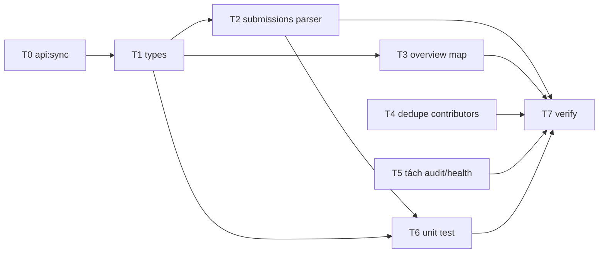

# PLAN — Fix FE & hoàn thiện chức năng Phân tích & Thống kê

> **Nguồn:** [`docs/AUDIT-phan-tich-thong-ke.md`](AUDIT-phan-tich-thong-ke.md)
> **Mode:** PLANNING (no code in this doc)
> **Project Type:** **WEB** (React + TypeScript + Vite, Recharts)
> **Primary agent:** `frontend-specialist`
> **Ngày:** 2026-06-01

---

## 1. Overview

### What
Sửa và hoàn thiện phần **Frontend** của tab Admin 「Phân tích & thống kê」 (`?section=analytics`) dựa trên các gap trong audit: parser sai shape, lệch types FE ↔ swagger, fetch trùng, scope lẫn lộn, fallback không rõ ràng.

### Why
- `getSubmissionsTrend()` parse sai contract `SubmissionAnalyticsDto` → khi BE bật thật sẽ vỡ chart.
- `AnalyticsOverview.totalRecordings` ≠ swagger `OverviewMetricsDto.totalSongs` → không map được dữ liệu thật.
- Double-fetch `contributors` (hook + component) → lãng phí.
- Audit/Health log lẫn trong tab analytics → khó bảo trì.

### Phạm vi đã chốt với user
| Quyết định | Giá trị |
|------------|---------|
| **Scope** | FE + đồng bộ types theo swagger (codegen). **KHÔNG** sửa code Backend. |
| **Chiến lược dữ liệu khi BE stub** | **Giữ nguyên hành vi hiện tại** (fallback client-side vẫn chạy), chỉ refactor cho đúng shape. |

### Ngoài phạm vi (OUT OF SCOPE)
- ❌ Implement BE stub `overview` / `submissions` (`AnalyticsController.cs`).
- ❌ Sửa `[AllowAnonymous]` trên `AnalyticsController` (ghi nhận là việc BE riêng — ANA-01).
- ❌ Thay đổi luồng nghiệp vụ, API mới.

---

## 2. Success Criteria

| # | Tiêu chí đo được |
|---|------------------|
| SC-1 | `analyticsApi.getSubmissionsTrend()` parse đúng `SubmissionAnalyticsDto` (có `total`, `byStatus`, …) VÀ vẫn trả `Record<string,number>` theo tháng cho chart. |
| SC-2 | FE types (`src/types/analytics.ts`) khớp các DTO swagger; không còn field "ảo" không có trong contract (hoặc được đánh dấu rõ là FE-only). |
| SC-3 | `AnalyticsOverview` map được `OverviewMetricsDto` (totalSongs/views/activeUsers/growthRate) — `remoteTotalRecordings` đọc đúng field khi BE có dữ liệu. |
| SC-4 | `contributors` chỉ fetch **1 lần** mỗi lần vào section (truyền từ hook xuống `ContributorLeaderboard`). |
| SC-5 | Audit log + System health tách khỏi nội dung "Analytics" thuần (accordion/section riêng "Vận hành hệ thống"). |
| SC-6 | Fallback client-side giữ nguyên hành vi nhưng có chú thích "dữ liệu tạm tính" khi dùng fallback (không đổi logic). |
| SC-7 | `npm run lint` + `npx tsc --noEmit` + `npm run build` PASS. |
| SC-8 | E2E `tests/e2e/40-analytics-charts.spec.ts` và `36-admin-dashboard.spec.ts` vẫn xanh. |

---

## 3. Tech Stack

| Layer | Công nghệ | Lý do |
|-------|-----------|-------|
| UI | React + TypeScript | Codebase hiện tại |
| Charts | Recharts | Đã dùng (`CoverageGapChart`, `ContentAnalyticsPanel`, `MonthlyTrendChart`) |
| API client | `openapi-fetch` (`apiFetch` / `apiFetchLoose`) + generated types | Giữ contract-typed |
| Codegen | `npm run api:sync` (openapi-typescript) | Đồng bộ swagger → `src/api` types |
| Test | Vitest (unit) + Playwright (e2e) | Đã có |

---

## 4. File Structure (các file tác động)

```
src/
├── services/
│   └── analyticsApi.ts                      # T2, T3 — parser + mapping
├── types/
│   └── analytics.ts                         # T1 — đồng bộ DTO swagger
├── api/
│   └── (generated types từ swagger.json)    # T0 — api:sync
├── features/admin/hooks/
│   └── useAdminDashboardData.ts             # T3, T4 — overview map, contributors
├── components/features/analytics/
│   ├── ContributorLeaderboard.tsx           # T4 — nhận props thay vì tự fetch
│   ├── MonthlyTrendChart.tsx                # T3 — chú thích fallback
│   ├── CoverageGapChart.tsx                  # (không đổi logic, chỉ type-check)
│   └── ContentAnalyticsPanel.tsx            # T1 — bỏ field FE-only nếu cần
└── components/admin/
    └── AdminDashboardAnalyticsPanel.tsx     # T5 — tách Audit/Health section
tests/
├── unit/ (mới)                              # T6 — test parser
└── e2e/40-analytics-charts.spec.ts          # T7 — verify
```

---

## 5. Task Breakdown

> Mỗi task: **Agent · Skill · Priority · Dependencies · INPUT → OUTPUT → VERIFY**

### T0 — Đồng bộ types từ swagger (codegen)
- **Agent:** `frontend-specialist` · **Skill:** `nextjs-react-expert` / `clean-code` · **Priority:** P0 · **Deps:** none
- **INPUT:** `src/api/swagger.json` (có `OverviewMetricsDto`, `SubmissionAnalyticsDto`, `CoverageChartDto`, `ContentAnalyticsResponseDto`, `ContributorLeaderboardDto`, `ExpertPerformanceResponseDto`).
- **OUTPUT:** Chạy `npm run api:sync` → generated types cập nhật trong `src/api`.
- **VERIFY:** `git diff` cho thấy types mới; `npx tsc --noEmit` không lỗi import.
- **Rollback:** revert file generated.

### T1 — Căn chỉnh `src/types/analytics.ts` theo DTO swagger
- **Agent:** `frontend-specialist` · **Skill:** `clean-code` · **Priority:** P0 · **Deps:** T0
- **INPUT:** Generated DTO + types FE hiện tại (lệch: `totalRecordings` vs `totalSongs`; `mostViewedSongs` không có trong swagger).
- **OUTPUT:**
  - `AnalyticsOverview` ánh xạ `OverviewMetricsDto` (giữ alias FE nếu cần, comment rõ field nào FE-only).
  - `ContentAnalyticsDto` đánh dấu `mostViewedSongs` là **FE-only/optional** hoặc loại bỏ nếu không dùng.
  - `ContributorRow` giữ alias `id`/`submissions` (dùng khi merge user) + comment.
- **OUTPUT (chi tiết):** type comment trỏ tới DTO swagger tương ứng.
- **VERIFY:** `npx tsc --noEmit` PASS; grep không còn usage field đã xoá.
- **Rollback:** revert `analytics.ts`.

### T2 — Sửa parser `getSubmissionsTrend()` đúng `SubmissionAnalyticsDto`
- **Agent:** `frontend-specialist` · **Skill:** `clean-code` · **Priority:** P0 · **Deps:** T1
- **INPUT:** `analyticsApi.ts` hiện chỉ chấp nhận `Record<string,number>`; swagger trả object `{ total, byStatus, avgReviewTime, topEthnicGroups }` (không có trend theo tháng trực tiếp).
- **OUTPUT:** Parser xử lý cả 2 shape:
  1. Nếu nhận `Record<string,number>` (legacy / fallback) → giữ.
  2. Nếu nhận `SubmissionAnalyticsDto` → trích `byStatus`/`byMonth` (nếu BE thêm) thành `Record<string,number>`; nếu không có chiều tháng thì trả `{}` (FE fallback đếm từ recordings — **giữ nguyên hành vi**).
- **VERIFY:** Unit test (T6) cover cả 2 shape; chart không vỡ.
- **Rollback:** revert hàm.

### T3 — Map `OverviewMetricsDto` trong `useAdminDashboardData`
- **Agent:** `frontend-specialist` · **Skill:** `nextjs-react-expert` · **Priority:** P1 · **Deps:** T1
- **INPUT:** Hook đọc `overview?.totalRecordings` (không tồn tại trên swagger DTO).
- **OUTPUT:** Đọc đúng field swagger (`totalSongs` → coi như tổng bản ghi) với fallback `recordingArr.length` **giữ nguyên thứ tự ưu tiên hiện tại**. Thêm chú thích "dữ liệu tạm tính" cho `MonthlyTrendChart` khi dùng `monthlyCounts` client (cờ boolean, không đổi logic tính).
- **VERIFY:** `remoteTotalRecordings` hiển thị đúng khi mock overview có `totalSongs`; fallback vẫn chạy khi stub.
- **Rollback:** revert đoạn mapping.

### T4 — Bỏ double-fetch `contributors`
- **Agent:** `frontend-specialist` · **Skill:** `nextjs-react-expert` (re-render/data-fetching) · **Priority:** P1 · **Deps:** none
- **INPUT:** `useAdminDashboardData` đã gọi `getContributors`; `ContributorLeaderboard` lại tự gọi.
- **OUTPUT:** Truyền dữ liệu contributors (+ trạng thái loading/error) từ hook xuống `ContributorLeaderboard` qua props; component bỏ `useEffect` fetch riêng (giữ fallback nếu props undefined để không phá nơi khác).
- **VERIFY:** Network tab chỉ 1 request `/Analytics/contributors` khi vào section; bảng vẫn render.
- **Rollback:** trả lại self-fetch.

### T5 — Tách Audit log + System health khỏi nội dung Analytics
- **Agent:** `frontend-specialist` · **Skill:** `frontend-design` · **Priority:** P2 · **Deps:** none
- **INPUT:** `AdminDashboardAnalyticsPanel` đang nhúng `AdminSystemHealthCard` + `AdminAuditLogPanel` (không thuộc tag Analytics).
- **OUTPUT:** Gom 2 panel này vào accordion/section riêng tiêu đề "Vận hành hệ thống" trong cùng tab (không tạo route mới, không đổi data source).
- **VERIFY:** UI vẫn hiện đủ; heading 「Phân tích bộ sưu tập」 chỉ chứa chart analytics thuần.
- **Rollback:** revert layout.

### T6 — Unit test parser analytics
- **Agent:** `test-engineer` · **Skill:** `testing-patterns` · **Priority:** P2 · **Deps:** T2, T1
- **INPUT:** Hàm `getSubmissionsTrend`, `normalizeCoverageRows` (trong `CoverageGapChart`), mapping overview.
- **OUTPUT:** Vitest cases: shape `Record<string,number>`, shape `SubmissionAnalyticsDto`, object rỗng (stub), coverage rows alias `count`/`value`/`name`.
- **VERIFY:** `npm run test` (hoặc `vitest run`) PASS.
- **Rollback:** xoá test file.

### T7 — Verification & build
- **Agent:** `frontend-specialist` / `qa-automation-engineer` · **Skill:** `lint-and-validate`, `webapp-testing` · **Priority:** P3 · **Deps:** T1–T6
- **INPUT:** Toàn bộ thay đổi.
- **OUTPUT:** Lint/type/build/e2e xanh.
- **VERIFY:** Lệnh ở Phase X.
- **Rollback:** n/a.

---

## 6. Dependency Graph



- **Song song được:** T4, T5 độc lập với T0–T3.
- **Serial:** T0 → T1 → (T2, T3) → T6 → T7.

---

## 7. Risk & Mitigation

| Rủi ro | Mức | Giảm thiểu |
|--------|-----|-----------|
| `api:sync` thay đổi nhiều generated types ngoài Analytics | TB | Review `git diff`, chỉ commit phần liên quan; build kiểm tra |
| BE submissions không có chiều tháng → chart vẫn rỗng | TB | Giữ fallback client-side (đã chốt), badge "tạm tính" |
| Bỏ self-fetch ContributorLeaderboard phá chỗ dùng khác | Thấp | Giữ fallback fetch khi props undefined; grep usage trước |
| Lệch type sau khi xoá `mostViewedSongs` | Thấp | Grep usage trước khi xoá; đánh optional thay vì xoá nếu còn dùng |

---

## 8. Phase X — Final Verification Checklist

```bash
# P0: Lint & Type
npm run lint
npx tsc --noEmit

# P1: Unit tests
npx vitest run src

# P2: Build
npm run build

# P3: E2E (cần server)
npx playwright test tests/e2e/40-analytics-charts.spec.ts tests/e2e/36-admin-dashboard.spec.ts
```

- [x] T0 — `npm run api:generate` từ `swagger.json` local (2026-06-01; `api:pull` 403 — BE remote tắt)
- [x] T1 — `analytics.ts` alias swagger DTOs + legacy `totalRecordings` (2026-06-01)
- [x] T2 — `parseSubmissionsTrendPayload` + `getSubmissionsTrend` (2026-06-01)
- [x] T3 — `resolveOverviewTotalRecordings` + `monthlyTrendIsEstimated` badge (2026-06-01)
- [x] T4 — contributors từ `useAdminDashboardData`, không fetch lại trong leaderboard (2026-06-01)
- [x] T5 — accordion 「Vận hành hệ thống」 cho Health + Audit (2026-06-01)
- [x] T6 — unit tests: parseSubmissionsTrend, normalizeCoverageRows, overview, contributors (2026-06-01)
- [x] T7 — `tsc` + `build` + unit analytics PASS; file analytics `eslint --fix` PASS (2026-06-01)
- [x] Không sửa code BE (đúng scope)
- [x] Hành vi fallback giữ nguyên

## ✅ PHASE X (T7) — 2026-06-01

| Check | Kết quả |
|-------|---------|
| `npx tsc --noEmit` | ✅ Pass |
| `npm run build` | ✅ Pass |
| Unit tests analytics (`vitest` 15 tests) | ✅ Pass |
| ESLint phạm vi analytics | ✅ Pass (`eslint --fix` trên file đã sửa) |
| `npm run lint` (toàn repo) | ⚠️ Fail — 5 errors + warnings **ngoài** phạm vi analytics (có sẵn trước plan) |
| E2E `40-analytics-charts` + `36-admin-dashboard` | ⏭ Skipped (không có admin session E2E) |

> Đánh dấu `[x]` chỉ sau khi thực sự chạy lệnh tương ứng.

---

## 9. After Planning

```
[OK] Plan created: docs/PLAN-analytics-fe-fix.md

Next steps:
- Review the plan
- Run /create để bắt đầu implement (bắt đầu T0)
- Hoặc chỉnh plan thủ công
```
